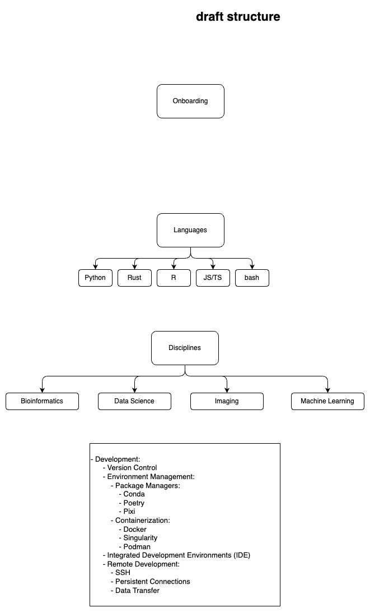

# Lab Handbook

## Draft Structure:



Edit this diagram using drawio or vscode drawio extension:  `./diagrams/handbook_overview.drawio`

## Table of Contents
- [Development](#development)
  - [Installing Pixi](#installing-pixi)
  - [Cloning the repository](#cloning-the-repository)
  - [Installing dependencies](#installing-dependencies)
  - [Building the documentation](#building-the-documentation)
  - [Previewing the documentation](#previewing-the-documentation)
  - [Adding Content to the Documentation](#adding-content-to-the-documentation)


## Development

### Installing Pixi

Pixi is a tool for managing conda environments and managing dependencies. 

To install pixi, visit the [pixi website](https://pixi.sh/) and follow the instructions for your operating system.

### Cloning the repository

Clone the repository to your local machine using the following command:

```bash
git clone https://github.com/bhklab/handbook.git
```

### Installing dependencies

To install the dependencies for the handbook, run the following command:

```bash
pixi install
```

This will install the dependencies specified in the `pixi.toml` file.

### Building the documentation

To build the documentation, run the following command:

```bash
pixi run build
```

This will build the documentation and output it to the `site` directory.

### Previewing the documentation

To preview the documentation, run the following command:

```bash
pixi run serve
```

This will start a local server and preview the documentation at `http://localhost:8000`.

### Adding Content to the Documentation

The documentation is written in Markdown and can be found in the `docs` directory. 

Here are the steps to add new content to the documentation:

1. Create a branch for your changes.
  ```bash
  git checkout -b <branch-name>
  # i.e git checkout -b adding-getting-started-page
  ```

2. Add your new content to the `docs` directory.
  ```bash
  touch docs/onboarding/getting_started.md
  ```

3. Add your new content to the `mkdocs.yml` file.
  ```yaml
  nav:
    - Home:
        - Welcome: index.md
    - Onboarding:
        - Introduction: onboarding/introduction.md
        - Getting Started: onboarding/getting_started.md
  ```

4. Preview your changes.
   ```bash
   pixi run serve
   ```

5. Commit and push your changes to your branch.
  ```bash
  git add .
  git commit -m "Add new getting started page"
  git push origin adding-getting-started-page
  ```

6. Create a pull request to merge your changes into the main branch.

  - Request a review from a maintainer.

