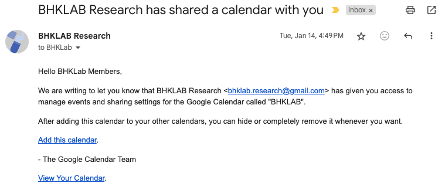

# BHKLab Calendar
The BHKLab Calendar is managed by `bhklab.research@gmail.com` and contains events for 

- [Mandatory lab meetings](../Meetings/index.md)
- One-on-one meetings with BHK
- Any other events the lab should be aware of

Your BHKLab Gmail account will be added to the BHKLab Calendar as part of your Onboarding. Make sure you check this calendar and your BHKLab email regularly so you are aware of any changes to the regular schedule or invitations to your assigned presentation days.

!!!note
    The BHKLab Calendar will not automatically be added to your Google Calendar. You will receive an email like the one below including the link to add the calendar to your Google Calendar.

    {width=90%}