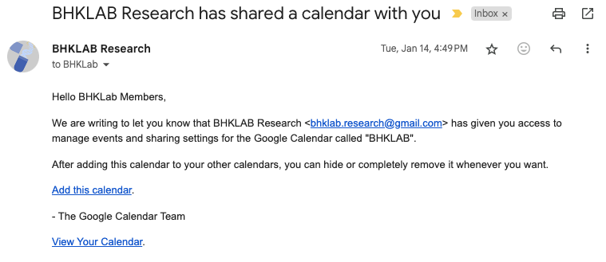

# BHKLab Calendar
The BHKLab Calendar is managed by `bhklab.research@gmail.com` and contains events for 

- [Mandatory lab meetings](../Meetings/index.md)
- One-on-one meetings with BHK
- Any other events the lab should be aware of

Your BHKLab Gmail account will be added to the BHKLab Calendar as part of your Onboarding. Make sure you check this calendar and your BHKLab email regularly so you are aware of any changes to the regular schedule or invitations to your assigned presentation days.

!!!note
    The BHKLab Calendar will not automatically be added to your Google Calendar. Once you've been added to the BHKLab-Members group, visit the [group's Conversations](https://groups.google.com/g/bhklab-members) and open the email with subject line "BHKLAB Research has shared a calendar with you" 
    
    You should see an email like the one below including the link to add the calendar to your Google Calendar.

    {width=90%}

## Event Availability (Free/Busy)

When creating or updating events in the BHKLab Calendar:

* Mark any BHKLab events that BHK is not attending as **"Free"** rather than **"Busy"**.
* Mark away-time events (e.g., vacation, conference travel, or other absences) as **"Free"**.

These settings keep everyone's availability accurate and avoid scheduling conflicts.

To set this in Google Calendar: open the event → change availability from
**Busy** to **Free** → **Save**.