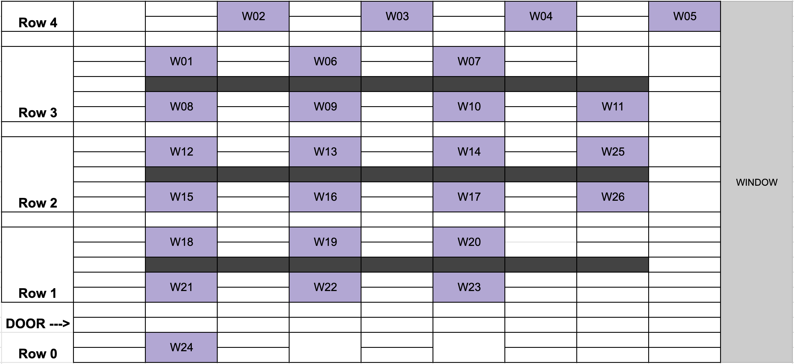

# The BHK Lab Space

The BHKLab is located in room 11-401 of the Princess Margaret Cancer Research Tower (PMCRT) in the MARS Discovery District. We share this space with other research labs under the Princess Margaret Research umbrella. Our lab space is to the left when you enter the room.

For directions to the lab, please see the BHKLab [Onboarding Policy](../../onboarding_offboarding/Onboarding/bhklab_onboarding.md).

## Accessing the Lab
To access the lab, you must have your UHN photo ID card and PMCRT access card. Please see the [UHN Onboarding Policy](../../onboarding_offboarding/Onboarding/uhn_onboarding.md) for instructions on how to obtain these cards.

??? tip "Pro Tip: Forgot your PMCRT Access Card?"
    If you have forgotten your PMCRT Access Card, you can go to the PMCRT Security Office on the main floor across from the PMCRT elevators and ask to borrow an access card for the day. They require that you leave a piece of photo ID that you can pick back up at the end of the day when you return the access card.

---

## Lab Workspace
We have four rows of workspaces available in the lab. You will be assigned a workspace during your BHKLab onboarding process.

---

## Lab Equipment Inventory
In the lab, each workspace is typically equipped with a monitor, keyboard, and a mouse. Unless otherwise specified, you are expected to bring in your own laptop. We utilize cloud-based services for computing and data storage, so your project work shouldn't take up too much space on your laptop.

To keep track of the lab hardware, we use a [Lab Equipment Inventory](https://docs.google.com/spreadsheets/d/1zFbTAdv5DT6tnajDMeXwoWP65VzjcD9PxynnXzholwE/edit?gid=212760015#gid=212760015&fvid=1883342253) spreadsheet. Each piece of equipment in the lab is labelled with a circular sticker, numbered, and logged in the spreadsheet. You can review the spreadsheet to confirm which pieces of equipment you have access to. 

??? "Note: Accessing the Lab Equipment Inventory"
    This spreadsheet is only accessible to BHKLab members via their [BHKLab Gmail](../Communications/bhklab_gmail.md) account. Please contact your lab coordinator if you need access.

??? warning "Warning: Missing Equipment"
    If a piece of equipment at your workspace is missing from the spreadsheet, or vice versa, please contact your lab coordinator.

---

## Other Lab Space Resources

* Washrooms are located on either end of the floor on every floor of the PMCRT. The women's washroom is on the south side (right from the elevators) and the men's washroom is on the north side (left from the elevators).
* There are kitchen facilities at either end of the floor on every floor of the PMCRT. A water dispenser is in the sink in both kitchens.
* The mini fridge to the left of the lab door and the kettle on top of it is available for use by lab members.