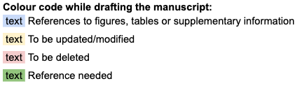

# Manuscript Writing Guidelines

<!-- TODO::
[Miro](https://miro.com/)
[Overleaf](https://www.overleaf.com/)
[BHKLAB Github repository](https://github.com/bhklab)
[Paperpile](https://paperpile.com/) -->

The following document should serve as a guideline for the current and future BHK lab members in preparing their manuscripts in a fashion that enables Benjamin to read their manuscripts as quickly as possible and provide his feedback.

**Read first:**

- [Scientific Writing Tips](https://www.huber.embl.de/group/posts/writingtips.html) by Wolfgang Huber  
- [How to construct a summary paragraph](https://www.nature.com/documents/nature-summary-paragraph.pdf)  
- [How to write an abstract](https://communities.springernature.com/posts/how-to-write-an-abstract)  
- [How to write a winning cover letter](https://www.science.org/content/article/writing-winning-cover-letter)

**The following are the suggested guidelines:**

1. Create a shared Google Drive directory containing all of your supplementary information. This Drive should then be shared with BHK (bhaibeka@gmail.com) and all the other Co-authors.  
2. Add [bhklab.research@gmail.com](mailto:bhklab.research@gmail.com) as an Editor for this shared directory. Then **transfer ownership** of that directory to [bhklab.research@gmail.com](mailto:bhklab.research@gmail.com). Your directory will be stored in the “Manuscripts” folder in the [bhklab.research@gmail.com](mailto:bhklab.research@gmail.com) Google account.  
3. At the top of your manuscript have the following legend and add the following highlighting guidelines throughout your manuscript for highlighting materials:

    | Resources:        |  |
    |-------------------|--|
    | Shared Directory: | Google Drive URL |
    | Editable Figures: | Miro URL Figures |
    | Tables and Supplementary Information: | Overleaf URL |
    | Computer Code:    | GitHub URL |
    | Container:        | Code Ocean URL 
    | References:       | use Paperpile.com |
   
    

4. At the very top of your paper underneath the title, have the authors with superscript numbers.   
   1. The superscripts each represent the institutions the authors belong to.  
5. List the institutions that the authors belong to beneath the author  
   1. Here is a list of departments and institutions that the BHK lab often collaborates with or works for:  
      1. Princess Margaret Cancer Centre, University Health Network, Toronto, Ontario, Canada.  
      2. Department of Medical Biophysics, University of Toronto, Toronto, Ontario, Canada.  
      3. Joint Department of Medical Imaging, University of Toronto, Toronto, Canada  
      4. Faculty of Medicine, University of Toronto, Toronto, Ontario, Canada.  
      5. ~~Ontario Institute for Cancer Research, Toronto, Ontario, Canada.~~  
      6. ~~Department of Computer Science, University of Toronto, Toronto, Ontario, Canada.~~  
      7. Vector Institute for Artificial Intelligence, Toronto, Ontario, Canada.  
6. For all section titles (ie Abstract, Results, etc) use Uppercase *Heading 1*.  
7. Within the above-mentioned sections if you have other titles use *Heading 2*.  
8. The regular text of the paper should be in Arial 11\.  
9. All figures should ultimately be created using [Miro](https://miro.com/).  
10. Figures, Tables and Supplementary Sections/Files should be placed in parentheses (avoid writing “Figure x shows ...” or “As can be seen in Table x …” but rather write “the results suggest … (Figure x)”)  
11. Have all your captions near your graphs for the first version of the paper.  The caption of a figure or table should always start with **one bolded sentence** summarizing its content. A figure/table caption must be sufficiently detailed to be understood on its own (ie, without reading the rest of the manuscript, aka standalone).
12. If you have small Tables you could create them in the Google Docs, however, bigger tables should be done within Google Sheet or as CSV. In general, avoid tables as much as possible, a graphic conveys messages more efficiently than many numbers.  
13. If applicable, store all of your supplementary methods, formulas, figures, tables, and supplementary info in [Overleaf](https://www.overleaf.com/) while writing your manuscript*.* When your papers are at a stage ready for BHK to take a look and compile your Overleaf into a single pdf.   
    1. In order to export the figures and tables, just export the Miro charts info to overleaf  
14. Your computer code used for your project should be stored on the [BHKLAB Github repository](https://github.com/bhklab).  
15. All of your processed data and code should be stored in your CodeOcean Capsule and the code must run properly.  
16. Compile all your references in [Paperpile](https://paperpile.com/). We only have limited licenses for this product, so we have to coordinate and plan to assign those licenses from one lab member to another.  
17. After a period, use single space before the new sentence (no double space).

# Cover Letter

A good cover letter can:

1. Help "sell" your manuscript to the journal editor
2. Provide a clear introduction to your work 
3. Explain why your manuscript will be of interest to the journal’s readers -- sometihng that is always a key factor for editors

As such, it is worth spending time writing a coherent and persuasive cover letter.

Write a letter that explains why the editor would want to publish your manuscript and convey a work’s importance for the editors and readers. The following structure covers all the necessary points that need to be included.

If known, address the editor who will be assessing your manuscript by their name. Include the date of submission and the journal you are submitting to.

**First paragraph**: include the title of your manuscript and the type of manuscript it is (e.g. review, research, case study). Then briefly explain the background to your study, the question you sought out to answer and why.

**Second paragraph**: you should concisely explain what was done, the main findings and why they are significant.

**Third paragraph**: here you should indicate why the readers of the journal would be interested in the work. Take your cues from the journal’s aims and scope. For example if the journal requires that all work published has broad implications explain how your study fulfills this. It is also a good idea to include a sentence on the importance of the results to the field.

**To conclude**, state the corresponding author and any journal specific requirements that need to be complied with (e.g. ethical standards).

The cover letter should also be used to highlight any potential issues such as related manuscripts currently under consideration in any other publication, as well as indicating whether you have had any prior discussions with an editor about the work described in the manuscript.

**TIP**: All cover letters should contain these sentences:

* We confirm that this manuscript has not been published elsewhere and is not under consideration by another journal.  
* All authors have approved the manuscript and agree with its submission to \[insert the name of the target journal\].

Sources:

* [https://www.springer.com/gp/authors-editors/authorandreviewertutorials/submitting-to-a-journal-and-peer-review/cover-letters/10285574](https://www.springer.com/gp/authors-editors/authorandreviewertutorials/submitting-to-a-journal-and-peer-review/cover-letters/10285574)  
* [https://support.nature.com/en/support/solutions/articles/6000245673-cover-letter-for-your-manuscript](https://support.nature.com/en/support/solutions/articles/6000245673-cover-letter-for-your-manuscript)

Example:

| March 18, 2021   Dear Editors,   We are pleased to submit our manuscript entitled “*Orchestrating and sharing large multimodal data for transparent and reproducible research*” as an Article in the *Nature Communications* Journal.   One of the fundamental challenges in research is ensuring that a study is fully reproducible, from data retrieval, to processing and subsequent analysis. With the continuous advances in biotechnology, including high-throughput molecular, pharmacological and radiological profiling, the intrinsic complexity of the data increased, making the computational pipelines used to process these data more intricate and difficult to replicate. Moreover, the development of new processing pipelines is allowing researchers to process the data in multiple ways, often extracting complementary information from the same assay. Importantly, with biotechnologies getting easier and cheaper to use, datasets are growing fast and are often updated, making it challenging for the community to keep track of all versions of the data. Therefore, there is a need for greater transparency, reproducibility and flexibility in the processing of large multimodal data to realize their full potential for research.   To address these issues, we developed ORCESTRA ([www.orcestra.ca](http://www.orcestra.ca))*,* a cloud-based platform that provides a transparent, reproducible, and flexible computational framework for processing and sharing large multimodal data. The ORCESTRA platform integrates genomic, pharmacological and radiological profiles of biological samples through the orchestration of automated processing pipelines to curate customized and fully documented data objects for future analyses. Our workflows utilize a data processing and versioning tool enabling curation, standardization and flexible normalization of large multimodal data, focusing on, but not limited to, cancer research using high-throughput biotechnologies. Users can customize their data object generation by selecting different versions of a dataset and molecular profile data that is processed with multiple genomic tools, all with full transparency, as the data provenance of each data object is fully documented and objects are automatically assigned a Digital Object Identifier (DOI).   We believe ORCESTRA will be a valuable contribution to the biomedical field, and will be of great interest to the readers of the *Nature Communications* journal. All authors have read and approved the final version of the manuscript. I confirm that the content of this manuscript has not been published previously and has not been submitted to another Journal. We have made our research fully reproducible by sharing all the data and documented code.   We thank you in advance for considering our manuscript for publication in the Journal.   Sincerely, Benjamin Haibe-Kains *Senior Scientist                               	Associate Professor* Princess Margaret Cancer Centre 	University of Toronto University Health Network  |
| :---- |

# Response to Reviewers

We thank the reviewers for their response and constructive comments for our manuscript titled “xxx” (Manuscript\_ID\_yyy). Based on the reviewers’ feedback, we have made substantial changes to the revised manuscript. Please find our response to the reviewers’ comments below. The reviewers’ comments are in black and our responses are in *blue*. 

Examples of responses:

| Reviewer \#1: This is a well written manuscript presenting artificial intelligence approaches to define bimodal gene expression as a tool to determine drug sensitivity in cancer. The premise of the work is that bimodal gene assessment would be a superior predictor of drug sensitivity. This work could deeply influence drug development and enhance the preclinical target validation in a comprehensive and robust way. The authors present extensive data demonstrating the role of AI in assessing bimodal gene expression as a comprehensive biomarker strategy. There are many interesting findings in this manuscript, but there are several areas of uncertainty and statements that should be addressed to place these findings in context of current and past clinical drug development and its relevance. *We thank the reviewer for her/his positive assessment of our manuscript. We have added our response to each comment below.*  Introduction: 1\) The introduction is somewhat unclear, are the authors focusing on gene expression as predictive markers of drug sensitivity assessment tools or prognostic markers as some of the examples that listed may suggest? *The focus of the manuscript is on genes with bimodal expression as candidate predictive biomarkers of drug sensitivity. The examples showcase the usefulness of bimodal genes in various biomarker settings as a motivation for their relevance. We have enhanced the relevant Introduction section to remove any confusion. Revised manuscript \- Section : For example, estrogen receptor (ESR1) bimodal expression defines two biological states within breast cancer patients. These states have been used to stratify breast cancer patients into the clinically-relevant subtypes (ER+/-) and derive treatment decisions. Another example in cancer genomics is the use of 73 bimodal genes within ovarian cancer to define molecular subtypes with distinct survival rate 12\. We also have shown that epithelial-to-mesenchymal transition (EMT) related genes were found to be bimodal pan-cancer and predictive of response to statin class of drugs 13\.* |
| :---- |

