# [Confluence SOW Tutorial](#confluence-sow-tutorial)

This tutorial will walk you through how to access Confluence, set up your Page Tree, and to write your weekly Summary of Work (SOW). 

## Logging on to Confluence

Make sure you are connected to either  

1. the UHN-wireless-corporate wifi if you are on-site  
2. the UHN VPN via GlobalProtect or otherwise if you are off-site or the UHN-wireless-corporate wifi is unavailable
!!! note  
     You cannot connect to the VPN if you are connected to the UHN-wireless corporate wifi 

Head to this link: [BHKLab SOW Confluence Space](https://collaborate.uhnresearch.ca/confluence/login.action?os_destination=%2Fpages%2Fviewpage.action%3FspaceKey%3DBHKLabSOW%26title%3DBHKLab-SOW&permissionViolation=true). You should see a page like this:
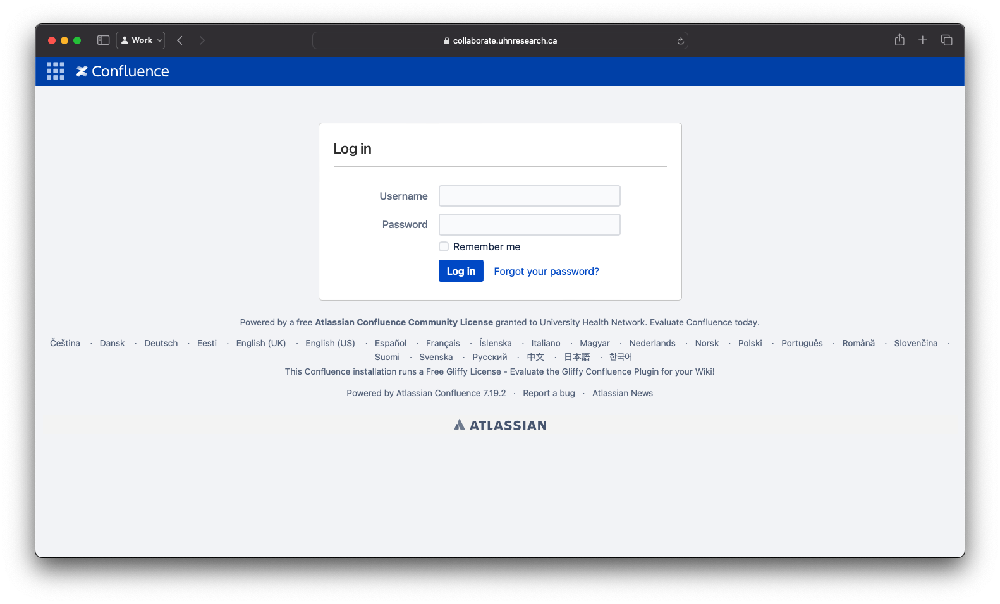 

Log in using your UHN username (usually your TID) and your UHN password.

## Navigating to the BHKLab-SOW Space

The [link](https://collaborate.uhnresearch.ca/confluence/login.action?os_destination=%2Fpages%2Fviewpage.action%3FspaceKey%3DBHKLabSOW%26title%3DBHKLab-SOW&permissionViolation=true) from step 2 should take you directly to the BHKLab-SOW space once you’re logged in that looks like this: 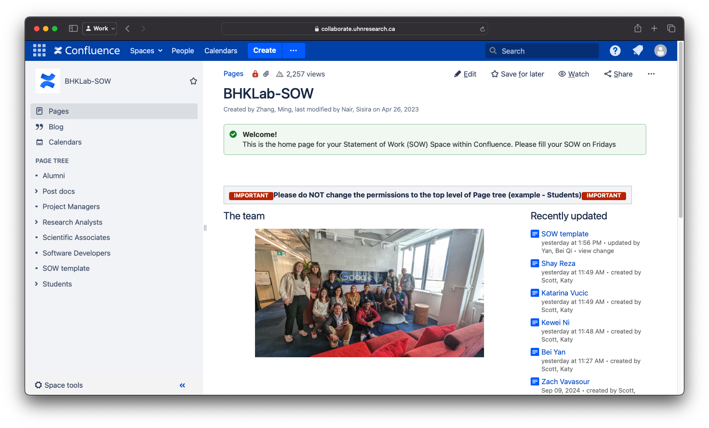

If you end up on a different page, navigate to the **Spaces** dropdown and select BHKLab-SOW:  
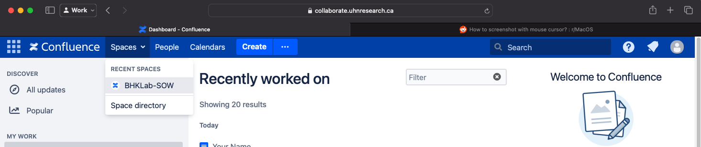

   

## Finding your section in the Page Tree
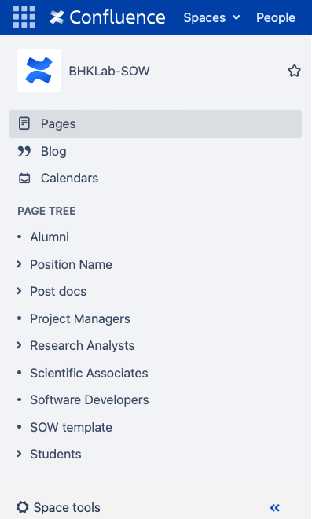{: align=right height=25% width=25% }
On the left side of the BHKLab-SOW page, find the PAGE TREE section and find the position name that you fall under. 

This will likely be the only one with an arrow (\>) next to it. 

Click this to list the files under this page, which should be a page with your first and last name.

!!! note
    If your name does not exist under the position you can open, stop here and contact a lab manager. They will set up the page appropriately for you.

      
Click the page with your name on it. 

You should now see a page like this with your name as the title.

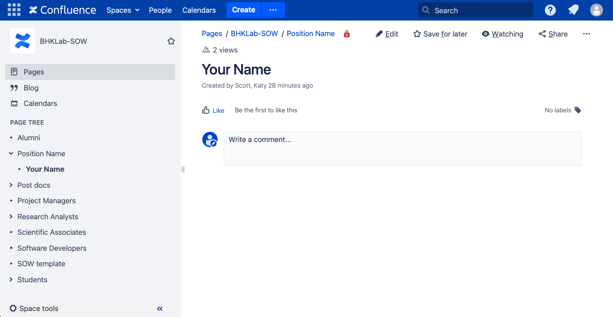{: height=70% width=70% }

## Setting up the year page for your SOWs

While on the page with Your Name on it, click the blue Create button at the top of the screen.

You should now see a blank page that you can edit. 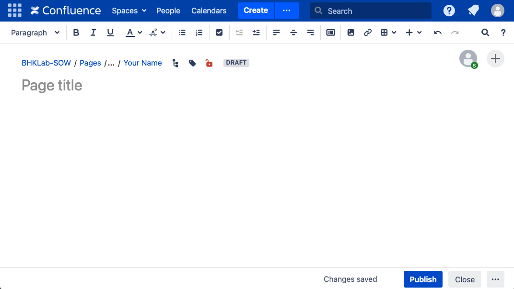  

Complete the following:

1. In the Page title section, enter **the year and your initials** in the format **YYYY \- YN**

2. Click on the red lock icon next to the DRAFT label. This will open a Restrictions menu. Click on the inherited view restrictions link (it will be blue). 

3. Under Your Name, confirm that BHK and a lab manager’s names are listed along with your own. This ensures that no one else can view your SOWs besides them.  
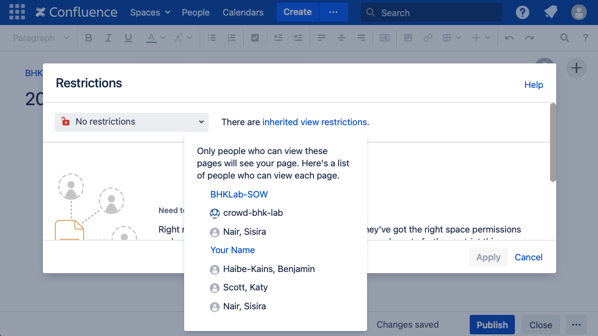{width=80%} 

    !!! warning
        If BHK and Sisira are not listed, contact a lab manager to have them set up the permissions properly.

4. Click the blue Publish button at the bottom right of the screen.

You should now see the page you just published listed under Your Name on the Page Tree. This is where you will navigate to to create your SOWs each week. When a new year starts, you will neeed to repeat this section to create a new year page.  
    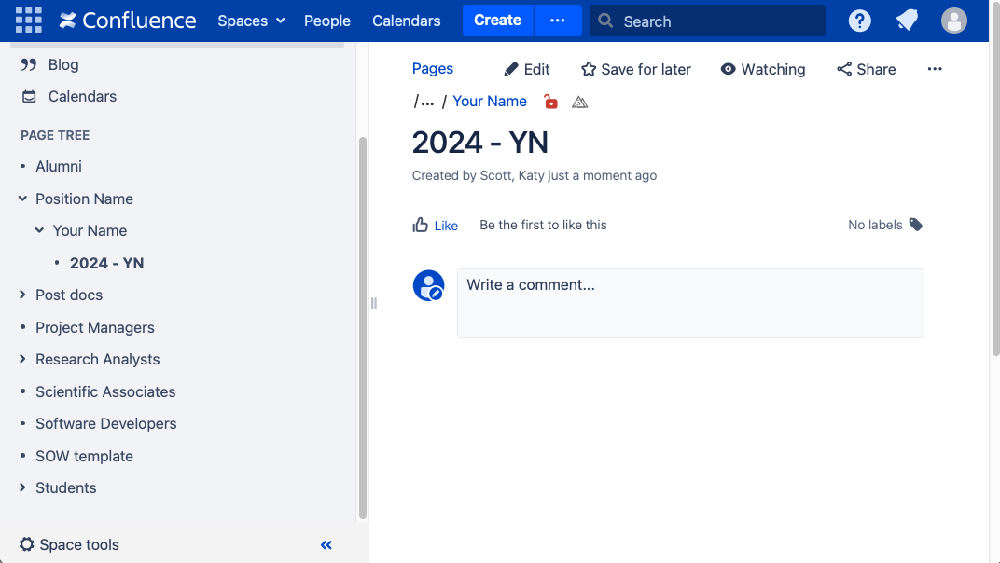{width=80%}  
    

## Creating your SOW Page

Navigate to the page under your name with the current year and your initials. There are two options to create this week’s SOW:    
!!! note
    If this is your first ever SOW, follow [From Create template](#from-create-template)

### **From Create template**

1. Click on the blue ellipses (...) button next to Create at the top of the page.

2. From the Create pop-up menu, scroll down and find the template labeled BHKLab-SOW.

    a. Select this and click Create on the bottom right of the pop-up.  
    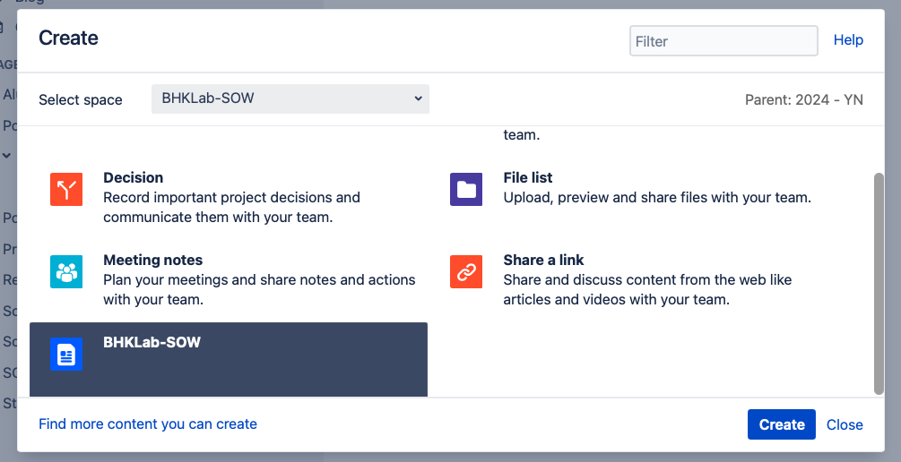{width=60%}

### **From previous week’s SOW**

1. In the page tree, click on your last published SOW

2. In the top right, click on the ellipses (...) and select Copy from the dropdown menu  
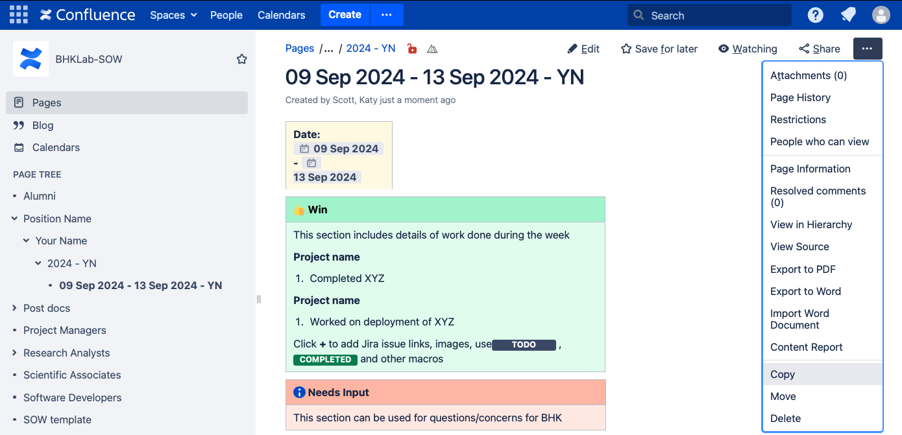{width=70%}

3. In the Copy page menu, make sure the parent page is set to the right year and click the blue Copy button  
   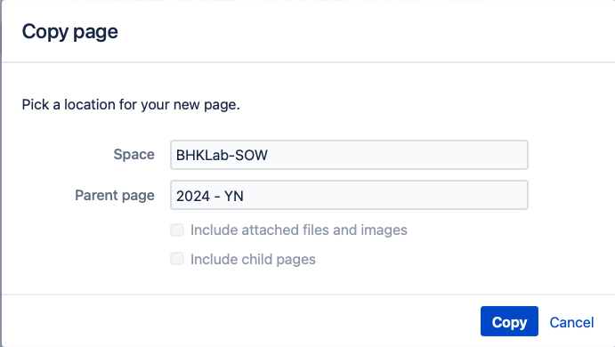{width=45%}

## Writing your SOW

**Date**: Set the dates in the yellow box to the first and last day of the current week (usually Monday and Friday)

**Page Title**: Write the dates exactly as shown in the yellow Date box **and your initials**
!!! note
    Note: the initials must be included in the title as Confluence won’t accept pages with the exact same name (e.g. you and another labmate post an SOW without initials)**  

**Win:** Detail work done on projects during the week

**Needs Input:** Any questions or concerns for BHK. BHK will respond to these on Slack.

**Focus**: What you plan to work on next week

**Important links:** Links to anything you mentioned in the above sections.

**BHK Read Marker:** For BHK use only. 
!!! note
    If you copied the previous week’s SOW, make that this is set to unchecked.  
    Unchecked:         Checked:   

Once completed, hit the blue Publish button in the bottom right or use `Ctrl + S` or `Cmd + S`. Your SOW should now be located under the year \- your initials page in the Page Tree at the bottom of your SOW list. _**THIS NEEDS TO BE MOVED TO THE TOP.**_  
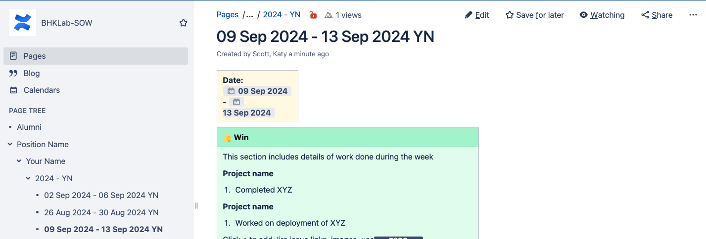

## **Reordering your SOW pages**

Navigate to Space Tools by either: 

1. Clicking on the ellipses (...) menu at the top right of the SOW page and selecting **View in Hierarchy**

2. Clicking Space tools at the bottom of the PAGE TREE section and selecting **Reorder pages**

On the Space Tools page, click and drag your most recent SOW and move it so it is directly below the year \- initials page:  
    Before:                                                                        After:   
    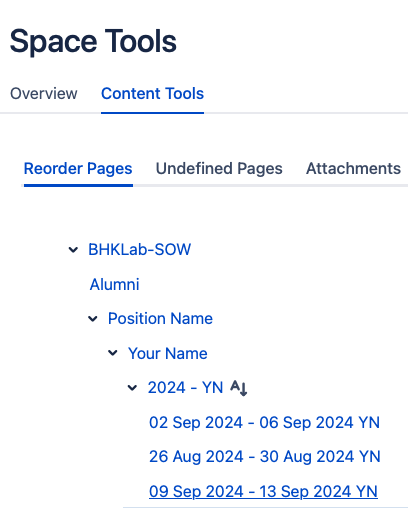{width=30%}           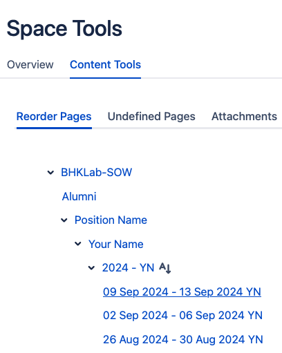{width=30%}

Click on the latest SOW to confirm it’s been properly moved.

You have now completed your SOW for the week\!

## **Draft SOW**

If your SOW page is not showing up in the PAGE TREE, it has likely been saved to your page drafts.

1. Click the Confluence logo in the top left of the site.

2. You should now be on the homepage with Recently worked on files listed. Your draft SOW will be listed here if it was saved. 

3. Click on it to continue editing and make sure to hit the Publish button in the bottom right. 