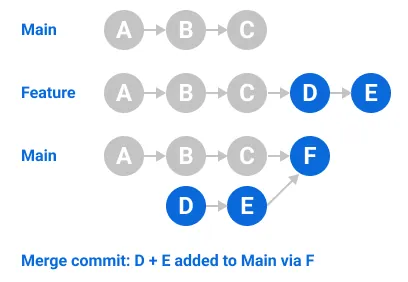
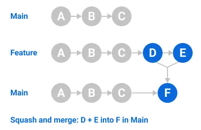
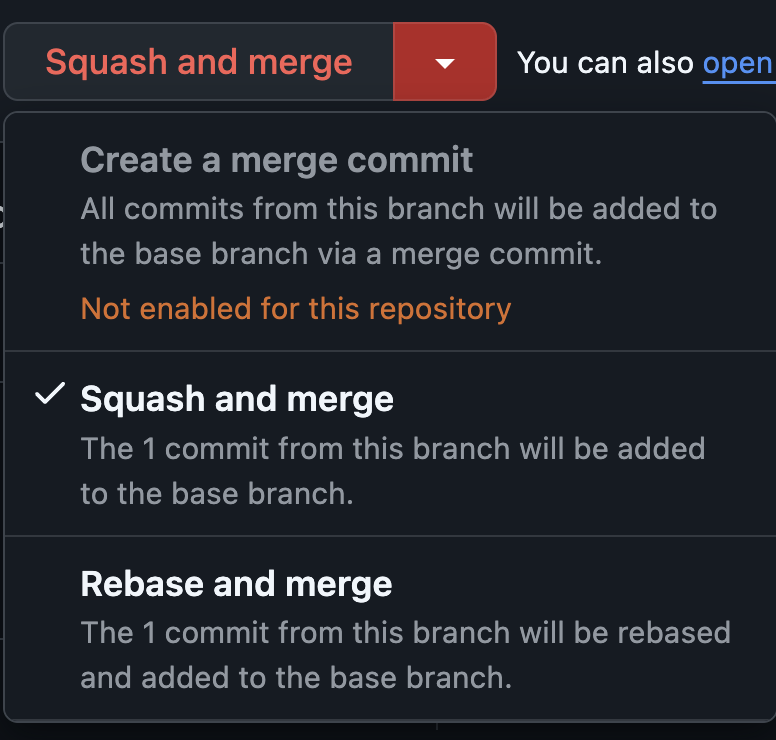
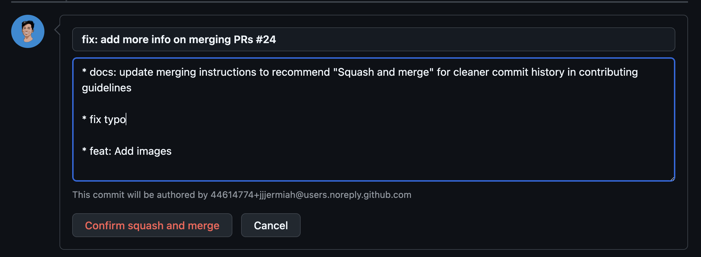
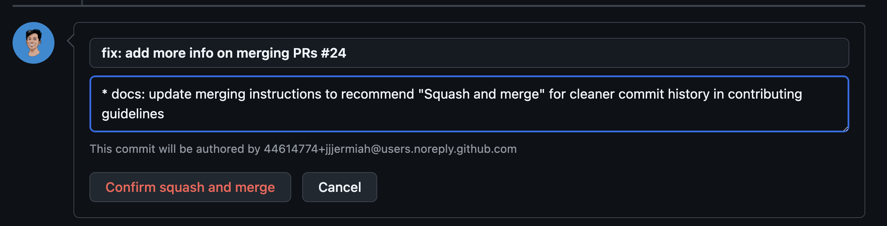

# Merging Pull Requests

!!! note "For Maintainers"
    Only a subset of members of the BHK Lab organization can merge pull requests.
    If you are a maintainer, you can merge a pull request by following the steps below.

## Validating the Pull Request

Before merging a pull request, it is important to validate the following:

1. Does the pull request have a title that is descriptive and concise?
2. Do all the Github Actions pass?
3. Has the pull request been reviewed by at least one member of the lab?
4. Are there any merge conflicts?
5. Does the PR add files that should not be added or mistakes? (i.e `.DS_Store`)

## Merge Strategy

Traditionally, when merging a pull request, all the commits from the
pull request are added to the main branch as individual commits along with a
merge commit (usually like `Merge pull request #123 from user/branch`).

This is called a **Merge Commit**.

<figure markdown="span" width="100%">
  
  <figcaption>Merge commit example</figcaption>
</figure>

We will be using the **Squash Merge** strategy for merging pull requests.

Squash merges are a way to combine multiple commits into a single commit.
Instead of seeing all the author's individual commits in the main branch's
commit history, you can see a single commit summarizing all the changes.

<figure markdown="span">
  
  <figcaption>Squash merge example</figcaption>
</figure>

More information on squash merges can be found in the [GitHub Docs on Squash Merges](https://docs.github.com/en/pull-requests/collaborating-with-pull-requests/incorporating-changes-from-a-pull-request/about-pull-request-merges#squash-and-merge-your-pull-request-commits)

This has a few benefits:

1. It keeps the commit history clean and organized.
2. It reduces the number of commits in the main branch, making it easier to manage.
3. Avoids the `Merge branch 'main' into main` commit that is created when merging
   a pull request in favor of using the `PR` title as the commit message.

## Merging a Pull Request

To merge a pull request, follow these steps:

### Click on the "Squash and merge" button.

{: style="height:50%;width:50%"}

### Modify the commit message as needed.

By default, the commit message will be the title of the pull request.
The body of the commit message will include all the commits from the pull request.

{: style="height:100%;width:100%"}

As you can see, there may be some commits that are not relevant to the pull request.

Feel free to modify the body of the commit message to include only the relevant commits.

!!! note

    Only the PR Title needs to follow the [Conventional Commits](https://www.conventionalcommits.org/en/v1.0.0/) specification.
    The commit message body can be modified to include any relevant commits.

{: style="height:100%;width:100%"}

### Verify GitHub Pages Deployment

After merging the pull request, the changes will be deployed to GitHub Pages.
Check the website at `https://bhklab.github.io/handbook/` to verify that the changes are correct.

### Delete the branch

Once the pull request is merged, delete the branch.
