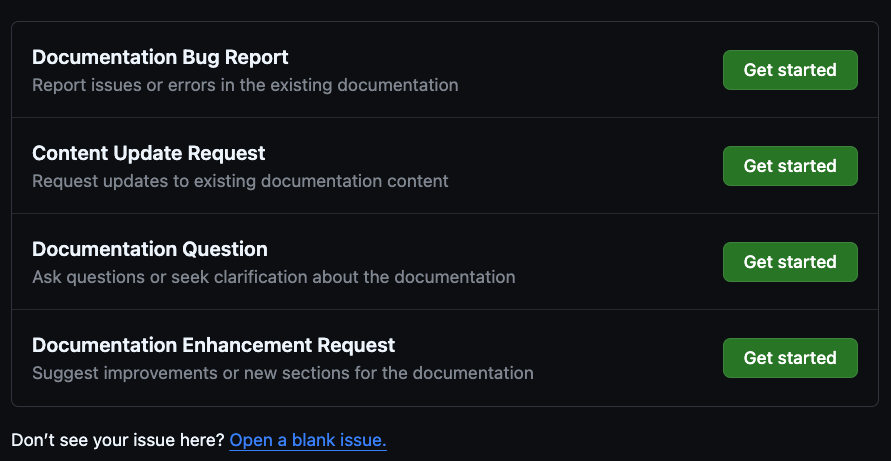

# Submitting Issues

## Introduction

If you encounter any issues, have suggestions, or need clarifications about
the documentation, you can submit an issue directly on our GitHub repository.
We have a set of pre-defined issue templates to help categorize and address
your concerns efficiently.

link: [Submit and view issues](https://github.com/bhklab/handbook/issues)

## Available Issue Templates

When creating a new issue, you will be presented with the following options:

  

1. **Documentation Bug Report**

    Use this template to report any errors or inconsistencies in the existing
    documentation. This could include typos, broken links, incorrect information,
    or anything that does not match the expected content.

2. **Content Update Request**

    Choose this template if you need to request updates to existing content.
     For example, if information is outdated or requires clarification,
     use this template to suggest the necessary changes.

3. **Documentation Question**

    Select this option to ask questions or seek clarification about specific
     parts of the documentation. This is useful if you are unsure about how
     certain sections apply to your work or if you need additional details
     on a topic.

4. **Documentation Enhancement Request**

    This template is for suggesting new content or improvements to existing
     sections. If you think the documentation can be expanded or restructured
     to better serve the users, please use this option.

## How to Submit an Issue

1. Go to the GitHub repository and navigate to the "Issues" tab.
2. Click on the "New Issue" button.
3. Select the appropriate issue template from the list
4. Fill out the template, providing as much detail as possible to help us
   understand and address your issue.
5. Submit the issue.

For any issues that do not fit the existing templates, you can
also select **Open a blank issue** to describe your concern freely.

## Tips for Submitting Effective Issues

- **Be Clear and Concise**: Provide a detailed description but be direct.
  Clear and specific information helps us address your issue faster.
- **Include Links and Screenshots**: If the issue relates to a specific
  section, page, or example, include links and screenshots to provide context.
- **Suggest Solutions**: If you have an idea on how to fix or improve the
  issue, let us know! Your suggestions can help expedite the process.

Your feedback is invaluable, and we
