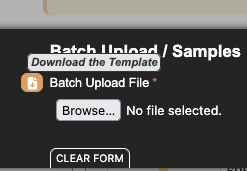

# EGA Data Upload

## Purpose

This document describes how to prepare metadata and sequencing files for submission to the European Genome-phenome Archive (EGA). This is NOT for array-based submissions (e.g: Genome-Wide Association Studies (GWAS), SNP arrays, and methylation arrays). Please refer to the [array submission](https://ega-archive.org/submission/metadata/submission/array/) documentation for further details.


You need:

## 1. EGA Submitter Box credentials 
Ask Benjamin or lab coordinator who has access to 1Password

!!! note

 This is different from a regular EGA account. Read more - [EGA Submitter Portal](https://share.google/uXjAgvE3r50QyFKvK)

## 2. UHN DAC number and DAC Policy number

Contact Natalie Stickle 

## 3. Data Processing Agreement signed 

Contact Natalie Stickle 

The Data Processing Agreement (DPA) information needs to be updated, and the Authorised Submitter List (ASL) may also be updated to reflect the current authorised users. 

For ASL, complete it with the full name and institutional email address of all individuals who should have access to this submission account. **Each individual must have an active EGA account**.

Please note that the Guidelines for Data Submission to the EGA have recently been updated. Under the revised guidelines, all submitting institutions are required to sign Data Processing Agreement (DPA) v1.5, which must be signed by the institution’s legal representative.

As the EGA continues to store and distribute data on your behalf as a Data Processor, and in accordance with GDPR and EMBL IP68, a valid DPA must be in place to ensure the lawful processing of your institution’s submitted data. 

This is to be signed by UHN/your institution (as the Data Controller).

### Who will upload raw files to EGA account?

Zhibin Lu (or responsible personnel from UHN Digital). You need to share the credentials securely with this person. 

## 4. Details of your research study

**Useful Notes from my correspondence with EGA Help Desk**

There is no overall limit on the total amount of data that can be submitted to the EGA under a submission
box. The size restriction applies only to the amount of data uploaded PER BATCH.

For large datasets (>20 TB), EGA recommend uploading the data in batches of approximately 10 TB. Once the first batch has completed upload and ensure it is successfully archived. You may proceed with uploading the next batch. This staged approach ensures stable processing and archiving of your files.

## EGA Object Structure: Know the Architecture First

Before touching any CSV, understand this hierarchy:

```python
Study
 ├── Sample (biological specimen)
 │     ├── Experiment (library prep + strategy)
 │           ├── Run (actual FASTQ files)
 └── Dataset (access-controlled grouping of files)
```

Think of it like this:

> Sample = the biology

> Experiment = how you prepared it

> Run = how you sequenced it

> Dataset = who is allowed to access it

! Most errors happen when these are mixed up.

**Gather data for the above entities before submission.**

You have to create a submission using EGA Submitter box account. This [video](https://youtu.be/o81GDFwXiGE?si=3LEm4dA8iokUJ4kN) is pretty useful in filling the different sections, however there are missing details. We will discuss a few of those below.

As discussed in the hierarchy above, EGA portal is divided into respective sections as shown in figure below. 

{: align=left height=100% width=100% }


### Preparing samples.csv

This file registers biological specimens. Each row represents one biological sample. Batch Uploads are recommended. You can download the batch upload template from EGA - Samples. It is hard to find, look closer!

{: align=left height=35% width=45% }

While the template will have the column **ID**, delete this before upload as this is EGA-assigned, else it will throw errors due to misplaced columns with their db.

**Important Rule**

> One biological sample = one row = one unique Alias.>

The next step is to fill each column in the template and require data wrangling and scraping pdfs.

| Field            | What to Put                       |
| ---------------- | --------------------------------- |
| Alias            | Unique sample ID (e.g., CD-3781)  |
| Title            | Short readable label              |
| Description      | Tissue, disease, context          |
| Biological Sex   | male / female / unknown           |
| Subject ID       | Internal subject identifier       |
| Phenotype        | disease or control status         |
| Case Control     | case / control                    |
| Organism Part    | tissue type (e.g., liver, lung)   |
| BioSample ID     | Leave blank if not pre-registered |
| Extra Attributes | Any structured metadata           |
| Others           | Usually auto-filled by system     |

### Should Alias Be Unique?

Yes. Always. Alias must be unique within Samples, Experiments, Runs. If you repeat, EGA will reject it.

### Who Creates the Alias?

The submitter (in this case, You) creates it.

Alias is Not assigned by EGA, Not auto-generated.

!!! Pro tip
    Add ascending numerical suffix to make the sample ids unique.


## Registering Experiments on EGA

**Should You Create One or Multiple Experiments?**

It depends.

Create ONE experiment if:

- Same sample
- Same library prep
- Same sequencing strategy
- Same insert size

Create MULTIPLE experiments if:

- Different library prep
- Different read length
- Different strategy (e.g., WGS vs WES)
- Different insert size distributions

**Experiments** represent library-level preparation.

## Registering Runs on EGA

**Runs** represent lanes or repeated sequencing. For example, WGS paired sequencing will have file1.fastq.gz
file2.fastq.gz. Arrange your csv to map from sample ids to fastq file 1 and file 2.

!!! Pro tip
    Add / before the fastq file names like so - /file1.fastq.gz, /file2.fastq.gz
    Make sure the number of raw files (eg: fastq) matches exactly with your metadata. Else file upload fails.

You can check with Zhibin to ensure the raw file numbers and MD5 checksums are uploaded.

## Create Dataset

You will need UHN Policy number for this. Email Natalie Stickle. Example - EGAP00001234567