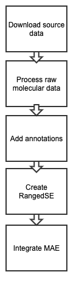

# Clinical Trial Curation

This documentation goes over the clinical trial data curation process in detail, mainly using immunotherapy data and then describing differences for non-immunotherapy data.

---

## Immunotherapy datasets
### Objective
The objective is to curate a clinical dataset into R's [MultiAssayExperiment](https://bioconductor.org/packages/release/bioc/html/MultiAssayExperiment.html) object. An example of a clinical data MultiAssayExperiment (MAE) object can be found in [ORCESTRA](https://zenodo.org/records/7332074). 

Currently, a clinical data object contains the following data parts:

1. Clinical metadata: Contains patient/sample metadata.
2. Molecular profiles: Molecular assay data (Currently RNA-seq, SNV or CNA) which is formatted in either [RangedSummarizedExperiment or regular SummarizedExperiment object](https://bioconductor.org/packages/devel/bioc/vignettes/SummarizedExperiment/inst/doc/SummarizedExperiment.html).

### Data Access
#### Public data

If the source is Pubmed, the raw omics files and clinical response metadata are available from Supplementary or external repository links in Data Availability section of the paper.

#### Private data

Private data such as PHI, clinical response might be available only upon request. Please contact the author(s) or whoever is responsible for requesting such data.

### Data Processing Overview
{: align=left height=25% width=25% }

An example of clinical data processing pipeline can be found here as [a Snakemake pipeline](https://github.com/BHKLAB-DataProcessing/ICB_Braun-snakemake/blob/main/Snakefile). 

Generally, an overall process of the curation follows the steps outlined below:

1. **Download source data**: Download data from publications or data repositories. The source data can be in various formats such as an Excel file, CSV or TXT. 
2. **Process raw molecular data, if available**: The RNA-seq processing from raw FASTQ is outlined on the [RNAseq raw processing page](https://collaborate.uhnresearch.ca/confluence/display/BHKLabPRC/RNA+seq+raw+processing).
3. **Add annotations**: Ensure that genes, tissues and treatments are annotated with metadata available from external source and lab standardized columns.
4. **Create RangedSummarizedExperiment or SummarizedExperiment (SE) object**: For the molecular data, we prefer RangedSummarizedExperiment as it is compatible with [GenomicRanges R package](https://bioconductor.org/packages/release/bioc/html/GenomicRanges.html).
5. **Create MAE object**: Format downloaded data to the layout and structure that is favourable to creating a MAE object. Through this process, the source data is extracted from the source data format and formatted into a CSV or TSV file. Integrate molecular data to MAE. 

### [Processing Clinical Metadata](#processing-clinical-metadata)
The clinical data should be formatted into patient/sample ids as rows and attributes as column data. This will be added as `colData` of the SE or MAE object.

The following columns are mandatory and should be filled with NA if the data is not available to maintain consistency across ICB and non-ICB datasets:

| **Column name**                          | **Description**                                                                                                                                                                                                                                            |
|------------------------------------------|------------------------------------------------------------------------------------------------------------------------------------------------------------------------------------------------------------------------------------------------------------|
| **Patientid**                            | This column contains unique patient identifiers                                                                                                                                                                                                            |
| **treatmentid**                          | This column contains the treatment regimen of each patient. Individual drug names are separated by ":" and standardized based on the lab's nomenclature. For example, the drug combo "FAC" is represented as "5-fluorouracil:Doxorubicin:Cyclophosphamide" |
| **response**                             | This column contains the response status of the patients to the given treatment - Responders (R) and Non-responders (NR)                                                                                                                                   |
| **tissueid**                             | Cancer type standardized based on the lab's nomenclature from Oncotree. Example:  “Breast”                                                                                                                                                                 |
| **survival_time_pfs/survival_time_os**   | The time starting from taking the treatment to the occurrence of the event of interest. The event name like "pfs", "os" must be appended to survival_time to differentiate the survival measure. Example for data in this column: “2.6”                    |
| **survival_unit**                        | The unit in which the survival time is measured. If the event is measured in other units such as “day”, or “year”, it must be converted to "month" for consistency                                                                                         |
| **event_occurred_pfs/event_occurred_os** | Binary measurement showing whether the event of interest occurred (1) or not (0).  The event name like "pfs", "os" must be appended to event_occurred to differentiate the survival measure                                                                |

!!!note
    Common columns have to be the first set of columns appearing in the metadata followed by the rest of the columns. You could add other columns with the name in the source data, but the standard columns with the above mentioned names should be present.
    
    If you are adding new columns based on restructured data from existing columns, please assign the lucid, self-explanatory column names.

The table below shows the other common columns across the 19 ICB datasets curated.

| Column name         | Description                                                                                                                                                                                                                             | type            |
|---------------------|-----------------------------------------------------------------------------------------------------------------------------------------------------------------------------------------------------------------------------------------|-----------------|
| age                 | Age                                                                                                                                                                                                                                     | source          |
| AMP                 | Sum of total AMP/coverage; calculated from CNA values                                                                                                                                                                                   | in-lab curation |
| cancer_type         | Type of cancer tissue                                                                                                                                                                                                                   | source          |
| CIN                 | Calculated from CNA values                                                                                                                                                                                                              | in-lab curation |
| CNA_tot             | Sum of total CNA/coverage; calculated from CNA values                                                                                                                                                                                   | in-lab curation |
| DEL                 | Sum of total DEL/coverage; calculated from CNA values                                                                                                                                                                                   | in-lab curation |
| dna                 | DNA sequencing type. eg: whole exome sequencing                                                                                                                                                                                         | source          |
| histo               | Histological info such as subtype                                                                                                                                                                                                       | source          |
| indel_nsTMB_perMb   | -                                                                                                                                                                                                                                       | in-lab curation |
| indel_nsTMB_raw     | -                                                                                                                                                                                                                                       | in-lab curation |
| indel_TMB_perMb     | -                                                                                                                                                                                                                                       | in-lab curation |
| indel_TMB_raw       | -                                                                                                                                                                                                                                       | in-lab curation |
| nsTMB_perMb         | -                                                                                                                                                                                                                                       | in-lab curation |
| nsTMB_raw           | -                                                                                                                                                                                                                                       | in-lab curation |
| recist              | Annotated using RECIST. The most commonly used responses are CR,PR,SD, PD.                                                                                                                                                              | source          |
| response.other.info | Same data as Responders (R) and Non-responders (NR)                                                                                                                                                                                     | source          |
| rna                 | Type of rna processed data. eg: TPM                                                                                                                                                                                                     | source          |
| sex                 | Sex of the patient - Male or Female                                                                                                                                                                                                     | source          |
| stage               | Cancer stage                                                                                                                                                                                                                            | source          |
| survival_type       | PFS or OS or both (denoted by '/'). If both, added by in-lab curation                                                                                                                                                                   | in-lab curation |
| TMB_perMb           | TMB per megabase (Mb) was performed as defined: TMB = mutns/target. With mutns = number of non-synonymous mutations; and target = target size of the sequencing See Supplementary Table S2 of https://pubmed.ncbi.nlm.nih.gov/36055464/ | in-lab curation |
| TMB_raw             | Tumor Mutation Burden raw values                                                                                                                                                                                                        | in-lab curation |
| treatment           | Drug target or drug name                                                                                                                                                                                                                | source          |


### Processing Molecular Data

The raw omics data files are obtained and processed in the lab. If the raw files are not available, processed data is used. Exceptions are Mutation data where only processed data is used to avoid ambiguity around matched normals.

In general, all molecular data should be formatted into genes (eg: transcript IDs for RNA profiling) as rows and patient/sample IDs as columns. 

#### RNA-seq data
First and foremost, **the RNA-seq data should be at gene-level and in TPM**. The TPM value should be log transformed with log2(TPM) + 0.001.

If the TPM values are not available, but counts values are available, you could use the following formula to convert counts value to TPM:
    ```
    GetTPM <- function(counts, gene_size) {
        x <- counts/gene_size
        return(t(t(x)*1e6/colSums(x)))
    }
    ```

If available, counts and transcript-level data (isoforms) should also be included.

#### SummarizedExperiment Object
Each molecular data needs to be formatted into a SummarizedExperiment (or RangedSummarizedExperiment) object. 

At minimum, SummarizedExperiment requires:

1. **colData** (the patient metadata) formatted in patient/sample IDs as rows and attribute data as columns.
2. **assay** (expression values) formatted in gene/transcript IDs as rows and patient/sample IDs as columns.
3. **rowData** (gene metadata) is gene metadata for the genes that exist in the assay, formatted as gene/transcript IDs as rows and attributes as columns. More details on the gene metadata below.

### Annotation
Lab standardized annotation data are stored in BHKLab-Pachyderm's Annotation repository.

#### Gene Annotations
Gene metadata is obtained from Gencode annotations. We have a few versions of Gencode annotation data available in .RData files. An .RData file includes data frames that contains gene and transcript information such as features_gene, features_transcript and tx2gene. Some of the available gene annotations include:

- [Gencode v19](https://github.com/BHKLAB-Pachyderm/Annotations/blob/master/Gencode.v19.annotation.RData)
- [Gencode v40](https://github.com/BHKLAB-Pachyderm/Annotations/blob/master/Gencode.v40.annotation.RData)

!!!note
    Please use the most recent version for your gene annotations from this repository. The version of Gencode must be decided after checking the reference genome. Follow Gene curation SOP for detailed steps

#### Drug Annotations
For clinical data, drug annotations are performed in case-by-case basis. For immunotherapy treatments, both instances such as anti-"target" (eg: anti-CTLA4) and monoclonal antibody brand names can be present. Please follow the Drug curation SOP to correctly annotate such cases using the standard lab files in the [Annotation](https://github.com/BHKLAB-Pachyderm/Annotations) repository.

#### Tissue Annotations
For tissue annotations that cannot be mapped using Tissue curation SOP to the standard lab files in the [Annotation repository](https://github.com/BHKLAB-Pachyderm/Annotations), manual review needs to be performed in case-by-case basis.

---

## Non-immunotherapy datasets

### Objective
While most steps overlap between immunotherapy and non-immunotherapy dataset curation, it is important to understand the differences. The following details focuses on the current data elements and finally the differences.

Currently, a non-ICB clinical dataset is curated into R's [SummarizedExperiment](https://bioconductor.org/packages/devel/bioc/vignettes/SummarizedExperiment/inst/doc/SummarizedExperiment.html) (SE) object and not MAE because of the absence of multiple omics data. Sample code for curation can be found on [Github](https://github.com/bhklab/Clinical-Trial-SE/blob/master/ClinicalTrial_SE_curation.Rmd).

### Curation
A non-ICB clinical data object contains the following data parts:

1. Expression values or `Assay` data
2. Clinical metadata: contains patient/sample metadata

#### Expression values or `Assay` data
Assay data contains genomic profiles of the patients. The data is usually processed in-house from raw files or in some instances, published processed data is used directly. For instance, gene expression profiles of the patients are typically generated by either microarray or RNA-seq platforms. In the BHK lab, we use Robust Multiarray Averaging (RMA) and CDF files from [Brainarray](http://brainarray.mbni.med.umich.edu/Brainarray/Database/CustomCDF/24.0.0/ensg.asp) for processing microarray data, and the [Kallisto](https://pachterlab.github.io/kallisto/about) method for processing RNA-seq data, as mentioned in immunotherapy curation.

#### Clinical metadata
Any data pertaining to the samples or clinical response can be included in the Phenodata object. This is either fetched from public platforms like GEO if the data is public or upon request in case of confidentiality. Metadata sections in the SE objects include a few mandatory columns which are populated either by information from the other columns or the original published paper. NA is used to fill out columns for which no information is found. Each SE object includes additional metadata that may or may not be available in other SE objects.

Mandatory columns are the same as immunotherapy `colData` (see [above](#processing-clinical-metadata)).

### Gene metadata
Similar to immunotherapy datasets, gene metadata for non-immunotherapy datasets is also obtained from [Gencode](https://www.gencodegenes.org/human/releases.html) annotations. "Ensembl.v99.annotation.RData" from "Gencode.v33.annotation.RData" is used for curating `rowData` of the SE object in non-immunotherapy datasets. Annotation data are available in BHKLab-Pachyderm's [Annotation repository](https://github.com/BHKLAB-DataProcessing/Annotations).