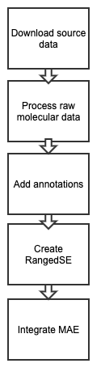

# IO Clinical Trial Curation

This documentation describes the curation process of clinical trial data for immunotherapy datasets into a standardized R object.

# Immunotherapy Datasets

## Objective

The objective is to curate clinical trial datasets into R's [MultiAssayExperiment (MAE)](https://bioconductor.org/packages/release/bioc/html/MultiAssayExperiment.html) object.  
An example curated MAE object is available on [ORCESTRA](https://zenodo.org/records/7332074).

Currently, a clinical data MAE includes:

1. Clinical metadata: Patient/sample information
2. Molecular profiles: RNA-seq, SNV, CNA data formatted as [RangedSummarizedExperiment or SummarizedExperiment](https://bioconductor.org/packages/devel/bioc/vignettes/SummarizedExperiment/inst/doc/SummarizedExperiment.html)


### Data Processing Overview
{: align=left height=25% width=25% }

An example of clinical data processing pipeline can be found here as [a Snakemake pipeline](https://github.com/BHKLAB-DataProcessing/ICB_Braun-snakemake/blob/main/Snakefile). 

Generally, an overall process of the curation follows the steps outlined below:

1. **Download source data**: Download data from publications or data repositories. The source data can be in various formats such as an Excel file, CSV or TXT. 
2. **Process raw molecular data, if available**: The RNA-seq processing from raw FASTQ is outlined on the [RNAseq raw processing page](https://collaborate.uhnresearch.ca/confluence/display/BHKLabPRC/RNA+seq+raw+processing).
3. **Add annotations**: Ensure that genes, tissues and treatments are annotated with metadata available from external source and lab standardized columns.
4. **Create RangedSummarizedExperiment or SummarizedExperiment (SE) object**: For the molecular data, we prefer RangedSummarizedExperiment as it is compatible with [GenomicRanges R package](https://bioconductor.org/packages/release/bioc/html/GenomicRanges.html).
5. **Create MAE object**: Format downloaded data to the layout and structure that is favourable to creating a MAE object. Through this process, the source data is extracted from the source data format and formatted into a CSV or TSV file. Integrate molecular data to MAE. 


Let's start curation: the first step is **Data Access**.

# 1. Data Access

## 1.1 Public Data

If the source is PubMed, raw omics files and clinical response metadata are available in Supplementary sections or external repository links under the Data Availability section of the paper.

## 1.2 Private Data

Private datasets containing PHI or detailed clinical response information may require access requests to the corresponding author or data custodian.


# 2. Data Processing Workflow

An example of the clinical data processing pipeline: [Snakemake pipeline (ICB Braun)](https://github.com/BHKLAB-DataProcessing/ICB_Braun-snakemake/blob/main/Snakefile)

## 2.1 General Workflow

{: align=left height=25% width=25% }

An example of clinical data processing pipeline can be found here as [a Snakemake pipeline](https://github.com/BHKLAB-DataProcessing/ICB_Braun-snakemake/blob/main/Snakefile). 

Generally, an overall process of the curation follows the steps outlined below:

1. **Download source data**: Download data from publications or data repositories. The source data can be in various formats such as an Excel file, CSV or TXT. 
2. **Process raw molecular data, if available**: The RNA-seq processing from raw FASTQ is outlined on the [RNAseq raw processing page](https://collaborate.uhnresearch.ca/confluence/display/BHKLabPRC/RNA+seq+raw+processing).
3. **Add annotations**: Ensure that genes, tissues and treatments are annotated with metadata available from external source and lab standardized columns.
4. **Create RangedSummarizedExperiment or SummarizedExperiment (SE) object**: For the molecular data, we prefer RangedSummarizedExperiment as it is compatible with [GenomicRanges R package](https://bioconductor.org/packages/release/bioc/html/GenomicRanges.html).
5. **Create MAE object**: Format downloaded data to the layout and structure that is favourable to creating a MAE object. Through this process, the source data is extracted from the source data format and formatted into a CSV or TSV file. Integrate molecular data to MAE. 


# 3. Clinical Metadata Curation

## 3.1 Objective

Format the clinical metadata:

- **Rows**: patient/sample IDs
- **Columns**: clinical attributes

This structure becomes the `colData()` in the MAE or SE.


## 3.2 Mandatory Columns

These columns must be filled (use `NA` if unavailable):

| **Column name**                          | **Description**                                                                                                                                                                                                                                            |
|------------------------------------------|------------------------------------------------------------------------------------------------------------------------------------------------------------------------------------------------------------------------------------------------------------|
| **Patientid**                            | This column contains unique patient identifiers                                                                                                                                                                                                            |
| **treatmentid**                          | This column contains the treatment regimen of each patient. Individual drug names are separated by ":" and standardized based on the lab's nomenclature. For example, the drug combo "FAC" is represented as "5-fluorouracil:Doxorubicin:Cyclophosphamide" |
| **response**                             | This column contains the response status of the patients to the given treatment - Responders (R) and Non-responders (NR)                                                                                                                                   |
| **tissueid**                             | Cancer type standardized based on the lab's nomenclature from [Oncotree](http://oncotree.mskcc.org/). Example:  “Breast”                                                                                                                                                                 |
| **survival_time_pfs/survival_time_os**   | The time starting from taking the treatment to the occurrence of the event of interest. The event name like "pfs", "os" must be appended to survival_time to differentiate the survival measure. Example for data in this column: “2.6”                    |
| **survival_unit**                        | The unit in which the survival time is measured. If the event is measured in other units such as “day”, or “year”, it must be converted to "month" for consistency                                                                                         |
| **event_occurred_pfs/event_occurred_os** | Binary measurement showing whether the event of interest occurred (1) or not (0).  The event name like "pfs", "os" must be appended to event_occurred to differentiate the survival measure                                                                |

!!!note
    Common columns have to be the first set of columns appearing in the metadata followed by the rest of the columns. You could add other columns with the name in the source data, but the standard columns with the above mentioned names should be present.
    

## 3.3 Common Additional Columns 

The table below shows the other common columns across the 19 ICB datasets curated.

| Column name         | Description                                                                                                                                                                                                                             | type            |
|---------------------|-----------------------------------------------------------------------------------------------------------------------------------------------------------------------------------------------------------------------------------------|-----------------|
| age                 | Age                                                                                                                                                                                                                                     | source          |
| AMP                 | Sum of total AMP/coverage; calculated from CNA values                                                                                                                                                                                   | in-lab curation |
| cancer_type         | Type of cancer tissue                                                                                                                                                                                                                   | source          |
| CIN                 | Calculated from CNA values                                                                                                                                                                                                              | in-lab curation |
| CNA_tot             | Sum of total CNA/coverage; calculated from CNA values                                                                                                                                                                                   | in-lab curation |
| DEL                 | Sum of total DEL/coverage; calculated from CNA values                                                                                                                                                                                   | in-lab curation |
| dna                 | DNA sequencing type. eg: whole exome sequencing                                                                                                                                                                                         | source          |
| histo               | Histological info such as subtype                                                                                                                                                                                                       | source          |
| indel_nsTMB_perMb   | -                                                                                                                                                                                                                                       | in-lab curation |
| indel_nsTMB_raw     | -                                                                                                                                                                                                                                       | in-lab curation |
| indel_TMB_perMb     | -                                                                                                                                                                                                                                       | in-lab curation |
| indel_TMB_raw       | -                                                                                                                                                                                                                                       | in-lab curation |
| nsTMB_perMb         | -                                                                                                                                                                                                                                       | in-lab curation |
| nsTMB_raw           | -                                                                                                                                                                                                                                       | in-lab curation |
| recist              | Annotated using [RECIST](https://recist.eortc.org/). The most commonly used responses are CR,PR,SD, PD.                                                                                                                                                              | source          |
| response.other.info | Same data as Responders (R) and Non-responders (NR)                                                                                                                                                                                     | source          |
| rna                 | Type of rna processed data. eg: TPM                                                                                                                                                                                                     | source          |
| sex                 | Sex of the patient - Male or Female                                                                                                                                                                                                     | source          |
| stage               | Cancer stage                                                                                                                                                                                                                            | source          |
| survival_type       | PFS or OS or both (denoted by '/'). If both, added by in-lab curation                                                                                                                                                                   | in-lab curation |
| TMB_perMb           | TMB per megabase (Mb) was performed as defined: TMB = mutns/target. With mutns = number of non-synonymous mutations; and target = target size of the sequencing See Supplementary Table S2 of [PMID: 36055464](https://pubmed.ncbi.nlm.nih.gov/36055464/) | in-lab curation |
| TMB_raw             | Tumor Mutation Burden raw values                                                                                                                                                                                                        | in-lab curation |
| treatment           | Drug target or drug name                                                                                                                                                                                                                | source          |
# 4. Molecular Data Processing

## 4.1 RNA-seq Data

First and foremost, **the RNA-seq data should be at gene-level and in TPM**. The TPM value should be log transformed with log2(TPM) + 0.001.

- Expected input: **TPM** values
- Transform:
```r
log2(TPM + 0.001)
```
- If only raw counts available:
```r
GetTPM <- function(counts, gene_size) {
  x <- counts / gene_size
  return(t(t(x) * 1e6 / colSums(x)))
}
```
- Include isoform (transcript-level) data when available.

If available, counts and transcript-level data (isoforms) should also be included.


## 4.2 SE Object Requirements

- `colData`: Clinical metadata, formatted in patient/sample IDs as rows and attribute data as columns..
- `assay`: Expression/mutation matrix, formatted in gene/transcript IDs as rows and patient/sample IDs as columns.
- `rowData`: Gene metadata (Ensembl, transcript info), formatted as gene/transcript IDs as rows and attributes as columns. More details on the gene metadata below.


# 5. Building the MultiAssayExperiment (MAE)

After generating SE objects:

- Integrate all data into a [MultiAssayExperiment](https://bioconductor.org/packages/release/bioc/html/MultiAssayExperiment.html)

## 5.1 Key MAE Components

- `colData()` — Clinical metadata
- `experiments()` — Molecular assays
- `sampleMap()` — Sample coordination map
- `assays()` — Access matrices

!!!note
 Sample IDs must match between metadata and assays.


# 6. Annotation Standards

Lab standardized annotation data are stored in BHKLab-Pachyderm's Annotation repository.

## 6.1 Gene Annotations

Lab standardized annotation data are stored in BHKLab-Pachyderm's Annotation repository.

#### Gene Annotations
Gene metadata is obtained from [Gencode](https://www.gencodegenes.org/human/releases.html) annotations. We have a few versions of Gencode annotation data available in .RData files. An .RData file includes data frames that contains gene and transcript information such as features_gene, features_transcript and tx2gene. Some of the available gene annotations include:

- [Gencode v19](https://github.com/BHKLAB-Pachyderm/Annotations/blob/master/Gencode.v19.annotation.RData)
- [Gencode v40](https://github.com/BHKLAB-Pachyderm/Annotations/blob/master/Gencode.v40.annotation.RData)

!!!note
    Please use the most recent version for your gene annotations from this repository. The version of Gencode must be decided after checking the reference genome. Follow Gene curation SOP for detailed steps


## 6.2 Drug Annotations

For clinical data, drug annotations are performed in case-by-case basis. For immunotherapy treatments, both instances such as anti-"target" (eg: anti-CTLA4) and monoclonal antibody brand names can be present. Please follow the Drug curation SOP to correctly annotate such cases using the standard lab files in the [Annotation](https://github.com/BHKLAB-Pachyderm/Annotations) repository.

## 6.3 Tissue Annotations

For tissue annotations that cannot be mapped using Tissue curation SOP to the standard lab files in the [Annotation repository](https://github.com/BHKLAB-Pachyderm/Annotations), manual review needs to be performed in case-by-case basis.


# 7. Example Dataset: ORCESTRA Website Tabs

Dataset Example: [**ICB_Van_Allen**](https://www.orcestra.ca/clinical_icb/62f29ca3b89ff37208748d8b)

Website Tabs:

- **Disclaimer**: Licensing, re-annotation note
- **Data**: RNA reference, publication reference
- **Pipeline**: Snakemake/Nextflow script links

Important Links:

- DOI: [Zenodo record](https://doi.org/10.5281/zenodo.7332074)
- Publication: PubMed reference
- GEO: GEO accession entry

R example:
```r
ICB_Van_Allen <- readRDS("path/to/ICB_Van_Allen.rds")
```
```r
A MultiAssayExperiment object of 2 listed experiments:
[1] expr: RangedSummarizedExperiment with 57820 rows and 42 columns
[2] snv: SummarizedExperiment with 13709 rows and 110 columns
```

# Final Overview

```
Raw Data (Clinical + Molecular)
    ↓
Clinical Metadata Curation
    ↓
Molecular Data Processing
    ↓
SummarizedExperiment Objects
    ↓
MultiAssayExperiment (MAE) Assembly
```


