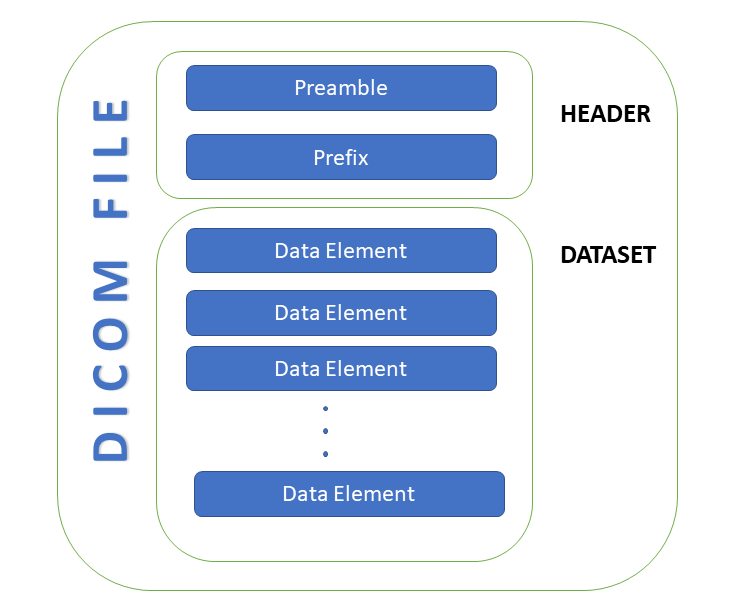
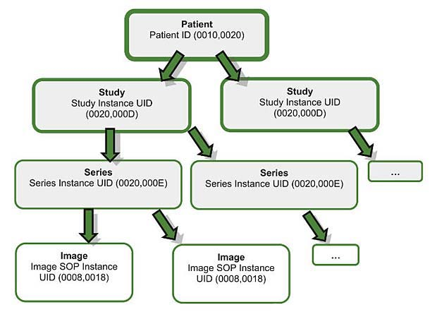
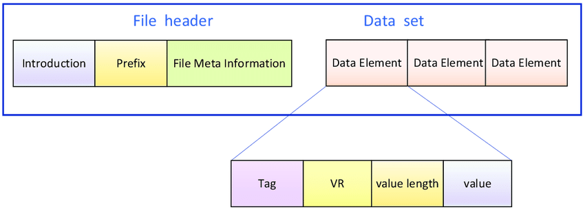

# DICOM (Digital Imaging and Communications in Medicine)

TODO: add introduction to DICOM

TODO: Add references if using images from online

#### DICOM Header Resources

- [DICOM Standard Browser](https://dicom.innolitics.com/ciods) - Find meaning of specific DICOM tags
- [Understanding DICOM](https://towardsdatascience.com/understanding-dicom-bce665e62b72/)
- 
