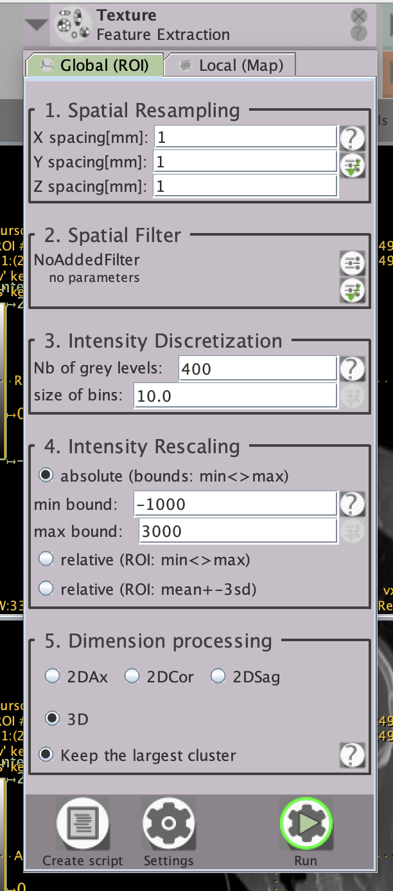

# Local Image Features Extraction (LIFEx)

#### Documentation Links:
1. [User Guide](https://www.lifexsoft.org/images/phocagallery/documentation/LIFEx/UserGuide/LIFExUserGuide.pdf)
2. [Features](https://www.lifexsoft.org/images/phocagallery/documentation/LIFExFeatures/LIFExFeatures.pdf)
3. [Scripts](https://www.lifexsoft.org/images/phocagallery/documentation/LIFExScripts/LIFExScripts_v7.8.0.pdf)
4. [More](https://www.lifexsoft.org/index.php/resources/documentation)

#### Sample LIFEx Script:
To work with batch data, you can upload a .txt format script to the software. This script includes a path for the results file in addition to the path and configurations for each input image. A sample script is provided here. For more syntax details review [Scripts](https://www.lifexsoft.org/images/phocagallery/documentation/LIFExScripts/LIFExScripts_v7.8.0.pdf).

This script will perform feature extraction with the same configuration as the LIFEx GUI picture below, but on a batch of two series:

{width="200" height="400"}

```sh
## Lines with ## are comments

LIFEx.Output.Directory=PATH_TO_RESULTS_DIR

## _________________________________________________________________________________________________________________________

## [Patient0] section

LIFEx.Patient0.Series0=PATH_TO_SERIES_DIR
LIFEx.Patient0.Series0.Operation0=Texture,true,false,false,1,3d,Absolute,10.0,400.0,-1000.0,3000.0,1.0,1.0,1.0
LIFEx.Patient0.Roi0=PATH_TO_ROI_DIR

## _________________________________________________________________________________________________________________________

## [Patient1] section

LIFEx.Patient1.Series0=PATH_TO_SERIES_DIR
LIFEx.Patient1.Series0.Operation0=Texture,true,false,false,1,3d,Absolute,10.0,400.0,-1000.0,3000.0,1.0,1.0,1.0
LIFEx.Patient1.Roi0=PATH_TO_ROI_DIR

## _________________________________________________________________________________________________________________________

```


#### Sample Python Script:

To generate a LIFEx script, you can run a Python script. This Python sample code is for generating a LIFEx script from data with the following storage format:


```bash
|-- {DATASET_NAME}
|   `-- {PatientID}
|       |-- {ImageModality}_{SeriesInstanceUID}
|       |   `-- {ImageModality}.nii.gz
|       `-- {SegmentationModality}_{SeriesInstanceUID}
|           `-- {ROI_name}.nii.gz
```

```python
import os
from pathlib import Path

# Path to output script to feed into LIFEx
output_script = Path("path/to/output/script.txt")
# Path to the lifex output (CSV file)
output_dir = Path("path/to/output/directory")
# Ensure the output directory exists
output_dir.mkdir(parents=True, exist_ok=True)
# Path to the base directory containing patient folders
dataset = Path("DATASET_NAME")

patient_ids = [p.name for p in dataset.iterdir() if p.is_dir()]

with open(output_script, "w") as f:
    # Write header
    f.write("## LIFEx script generated by BHKLab\n\n")
    f.write(f"LIFEx.Output.Directory={output_dir}\n\n")
    f.write("##_________________________________________________________________________________\n\n")
    patient_index = 0
    for patient in patient_ids:
        patient_path = dataset / patient
        if patient_path.is_dir():
            inner_folders = [p for p in patient_path.iterdir() if p.is_dir()]
            series_path = None
            roi_path = None
            
            for folder in inner_folders:
                if folder.name.startswith("{ImageModality}"):
                    series_path = folder
                elif folder.name.startswith("{SegmentationModality}"):
                    roi_path = folder
                else:
                    continue

            if series_path and roi_path:
                # Write patient section
                f.write(f"## [Patient{patient_index}] section\n\n")
                f.write(f"LIFEx.Patient{patient_index}.Series0={series_path}\n")

                # There can be multiple Operations or ROIs
                f.write(f"LIFEx.Patient{patient_index}.Series0.Operation0=Texture,true,false,false,1,3d,Absolute,10.0,400.0,-1000.0,3000.0,1.0,1.0,1.0\n")
                f.write(f"LIFEx.Patient{patient_index}.Roi0={roi_path}\n\n")
                f.write("##_________________________________________________________________________________\n\n")
                patient_index += 1

print(f"LIFEx script written to {output_script}")

```