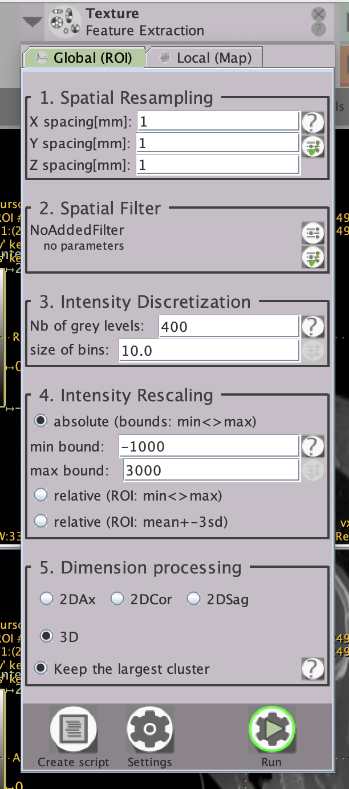

# LIFEx

#### Documentation Links:
1. [User Guide](https://www.lifexsoft.org/images/phocagallery/documentation/LIFEx/UserGuide/LIFExUserGuide.pdf)
2. [Features](https://www.lifexsoft.org/images/phocagallery/documentation/LIFExFeatures/LIFExFeatures.pdf)
3. [Scripts](https://www.lifexsoft.org/images/phocagallery/documentation/LIFExScripts/LIFExScripts_v7.8.0.pdf)
4. [More](https://www.lifexsoft.org/index.php/resources/documentation)

#### Sample LIFEx Script:
To work with batch data, you can upload a .txt format script to the software. This script includes a path for the results file in addiotion to paths and configurations for each input image. A sample script is provided here. For syntax details review [Scripts](https://www.lifexsoft.org/images/phocagallery/documentation/LIFExScripts/LIFExScripts_v7.8.0.pdf) please.

This script will perform feature extraction with the same configuration as the LIFEx GUI picture below, but on a batch of two series:



```sh
## Lines with ## are comments

LIFEx.Output.Directory=PATH_TO_RESULTS_DIR

## _________________________________________________________________________________________________________________________

## [Patient0] section

LIFEx.Patient0.Series0=PATH_TO_SERIES_DIR
LIFEx.Patient0.Series0.Operation0=Texture,true,false,false,1,3d,Absolute,10.0,400.0,-1000.0,3000.0,1.0,1.0,1.0
LIFEx.Patient0.Roi0=PATH_TO_ROI_DIR

## _________________________________________________________________________________________________________________________

## [Patient1] section

LIFEx.Patient1.Series0=PATH_TO_SERIES_DIR
LIFEx.Patient1.Series0.Operation0=Texture,true,false,false,1,3d,Absolute,10.0,400.0,-1000.0,3000.0,1.0,1.0,1.0
LIFEx.Patient1.Roi0=PATH_TO_ROI_DIR

## _________________________________________________________________________________________________________________________

```


#### Sample Python Script:

to generate a LIFEx script, you can use a python script generator. The follwing is a sample for that.

```sh
import os

# Path to output script to feed into LIFEx
output_script = ""
# Path to the lifex output (CSV file)
output_dir = ""
# Ensure the output directory exists
os.makedirs(output_dir, exist_ok=True)
# Path to the base directory containing patient folders
base_dir = ""

folder_names = os.listdir(base_dir)

with open(output_script, "w") as f:
    # Write header
    f.write("## LIFEx script generated by BHKLab\n\n")
    f.write("LIFEx.Output.Directory=" + output_dir + "\n\n")
    f.write("## _________________________________________________________________________________________________________________________\n\n")

    patient_idx = 0
    for folder in folder_names:
        folder_path = os.path.join(base_dir, folder)
"script_generator.py" [noeol] 42L, 1821C                      1,1           Top
```