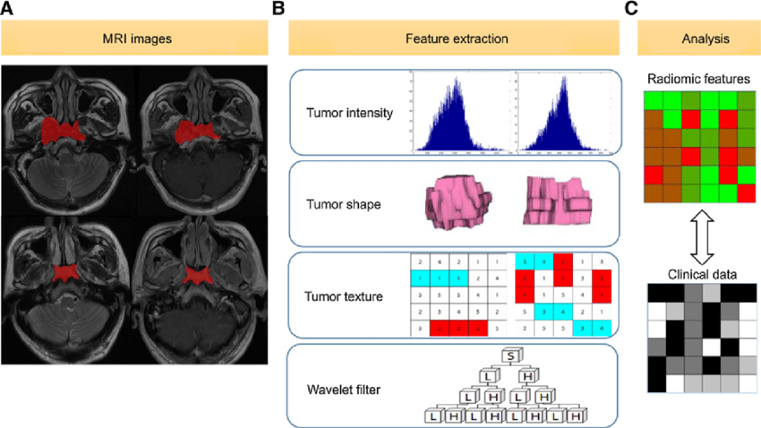

# Radiomics

Radiomics is the study of the interaction between radiation and support diagnosis, prognosis, and treatment planning. It bridges radiology and data science, allowing for a more detailed understanding of disease characteristics.

## Learn the Foundations

- **[Intro to Python (CS50 Week 6)](https://cs50.harvard.edu/python/2022/weeks/6/)**  
  Radiomics pipelines are often built in Python, so this course provides a solid foundation in the language.

- **[PyRadiomics Documentation](https://pyradiomics.readthedocs.io/en/latest/)**  
  The official documentation for PyRadiomics, a robust open-source Python package for extracting engineered features from medical images.

- **[Deep Learning Specialization by Andrew Ng](https://www.coursera.org/specializations/deep-learning)**  
  A comprehensive course that covers the fundamentals of deep learning. Highly relevant for radiomics pipelines that involve neural networks for image feature extraction or outcome prediction.

- **[Lightning in 15 Minutes](https://lightning.ai/docs/pytorch/stable/starter/introduction.html)**  
  A concise tutorial introducing PyTorch Lightning—an efficient and reproducible way to structure deep learning projects, especially useful for radiomics model development.

## Key Papers and Case Studies

- **[Decoding tumour phenotype by noninvasive imaging using a quantitative radiomics approach](https://www.nature.com/articles/ncomms5006) — *Nature Communications***  
  This seminal paper is widely credited with sparking interest in radiomics by demonstrating how quantitative imaging features can decode tumor phenotype.

- **[Radiomics strategies for risk assessment of tumour failure in head-and-neck cancer](https://www.nature.com/articles/s41598-017-10371-5) — *Scientific Reports***  
  A strong example of using engineered radiomic features to predict treatment outcomes in head-and-neck cancer.

- **[Deep learning for lung cancer prognostication: A retrospective multi-cohort radiomics study](https://journals.plos.org/plosmedicine/article?id=10.1371/journal.pmed.1002711) — *PLOS Medicine***  
  Combines radiomics with deep learning to predict survival outcomes, showcasing the power of hybrid approaches.

- **[Artificial intelligence in radiology](https://www.nature.com/articles/s41568-018-0016-5) — *Nature Reviews Cancer***  
  A high-level overview of AI’s role in modern radiology, including how radiomics fits into the broader clinical and research landscape.

