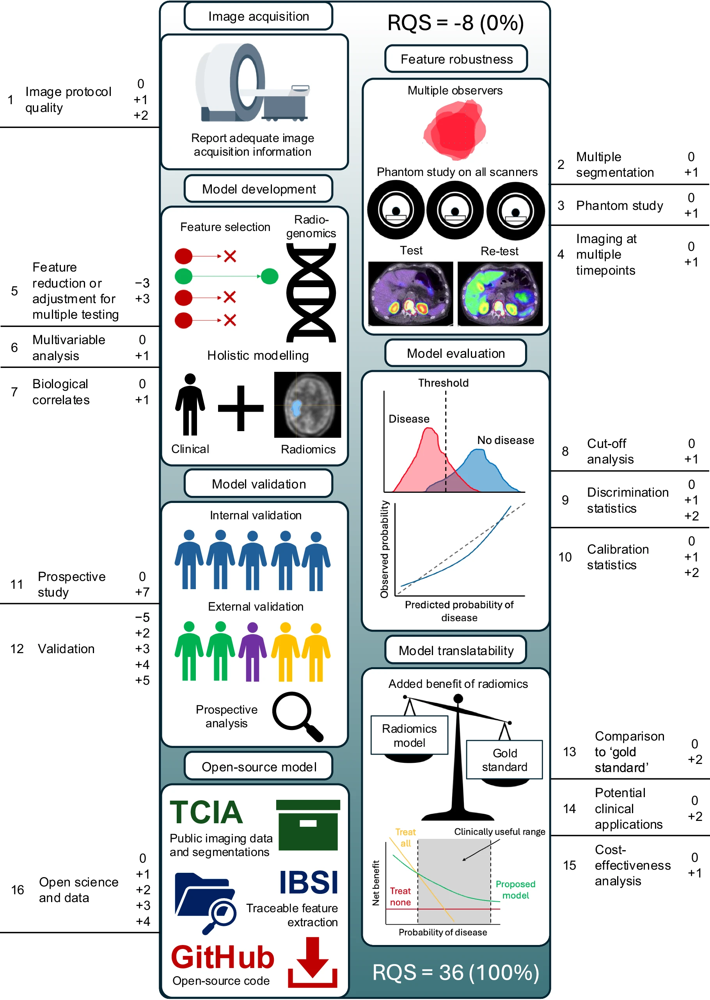

# Radiomics Score

## What is it?

A radiomics score is a quality assessment tool designed to evaluate the methodological rigor and reproducibility of radiomics research studies. The most widely used scoring systems are:

- **Radiomics Quality Score (RQS)**: A 16-point scoring system that evaluates various aspects of radiomics studies including image protocols, feature extraction, statistical methods, and validation approaches.

- **METhodological RadiomICs Score (METRICS)**: A newer, more comprehensive scoring tool endorsed by the European Society of Medical Imaging Informatics (EuSoMII) that provides detailed assessment criteria for radiomics research quality.

These scoring systems assess key methodological components such as:

- Image acquisition and reconstruction protocols

- Segmentation methodology and validation

- Feature extraction and selection processes

- Statistical analysis and model validation

- Open science practices and reproducibility measures

## Calculators
- [RQS Calculator](https://www.radiomics.world/rqs)
- [Another RQS Calculator](https://uwa-medical-physics-research-group.github.io/RQS-calculator/)
- [METRICS Calculator](https://metricsscore.github.io/metrics/METRICS.html)

{width="400" height="400"}
/// caption
A visual guide to the Radiomics Quality Score ([Source](https://link.springer.com/article/10.1007/s00330-024-11341-y/figures/1))
///
---

## Benefits

Radiomics scoring systems are essential for several critical reasons:

1. **Standardization**: They provide standardized criteria for evaluating the quality and reliability of radiomics research, helping to establish consistent methodological standards across the field.

2. **Reproducibility Crisis**: Early radiomics studies often suffered from poor reproducibility due to inconsistent methodologies. Scoring systems help identify and address these methodological gaps.

3. **Clinical Translation**: High-quality radiomics research with good scoring is more likely to translate successfully into clinical practice, as it demonstrates robust methodology and validation.

4. **Research Quality Assessment**: They enable researchers, reviewers, and clinicians to quickly assess the methodological rigor of radiomics studies and make informed decisions about the reliability of results.

5. **Identifying Best Practices**: By highlighting studies with high scores, these tools help identify and promote best practices in radiomics research methodology.

6. **Funding and Publication**: Many journals and funding agencies are increasingly considering methodological quality scores when evaluating radiomics research proposals and manuscripts.

---

## Sources
- [Radiomics: the bridge between medical imaging and personalized medicine](https://www.nature.com/articles/nrclinonc.2017.141)
- [Evaluating the impact of the Radiomics Quality Score: a systematic review and meta-analysis](https://link.springer.com/article/10.1007/s00330-024-11341-y)
- [METhodological RadiomICs Score (METRICS): a quality scoring tool for radiomics research endorsed by EuSoMII](https://link.springer.com/article/10.1186/s13244-023-01572-w#Sec13)