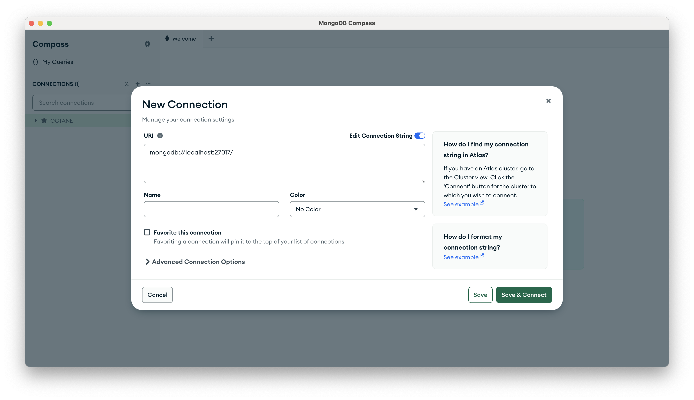
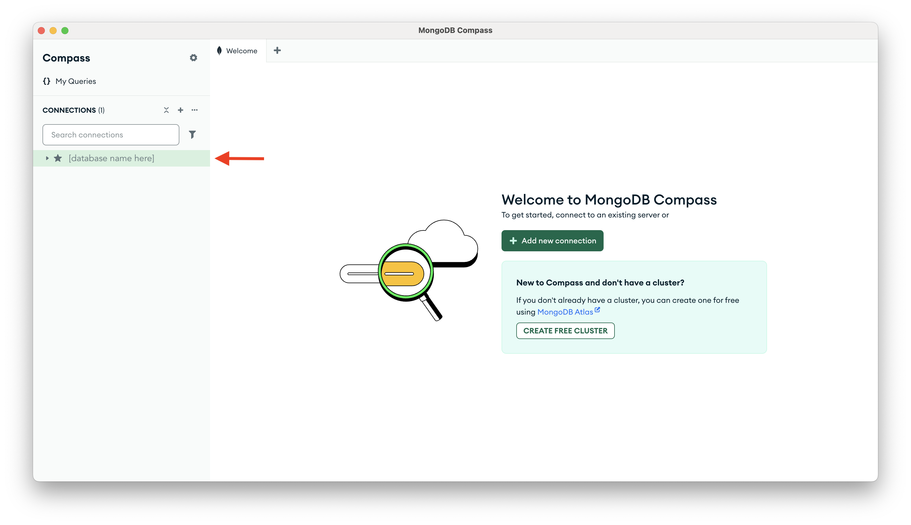
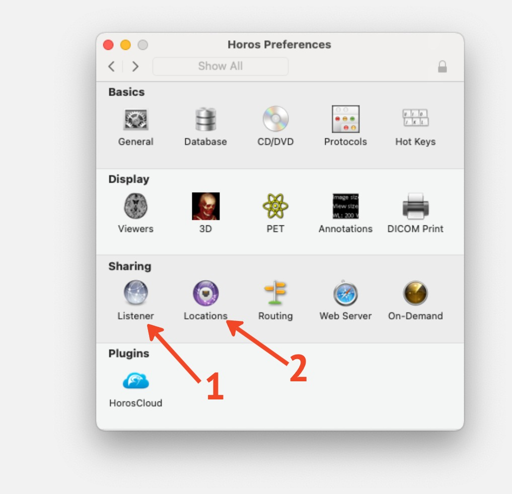
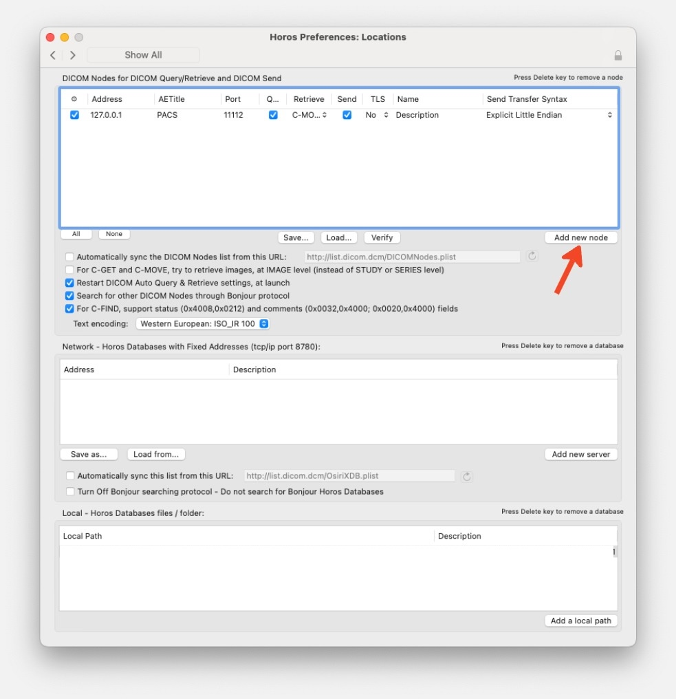
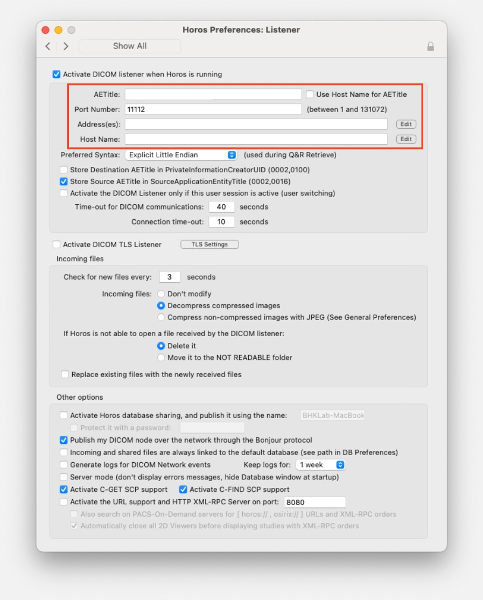
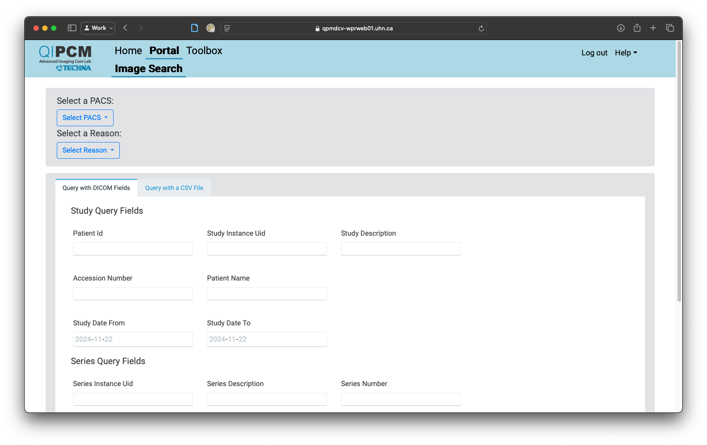

# [Querying Data from the QIPCM PACS](#querying-data-from-the-qipcm-pacs)

Once you've been added to a project's delegation log, the team at QIPCM will grant you access to the data. At this time of this writing, QIPCM cannot directly upload the data to H4H for us, so you will need to use the tools below to query the data and then upload it to [HPC4Health](../../../../software_development/Remote_Development/High_Performance_Computing_for_Health/index.md).

There are three tools you will need to access the data:

1. [The QIPCM Toolbox](https://qpmdcv-wprweb01.uhn.ca) (requires UHN Login)
2. [MongoDB Compass](https://www.mongodb.com/products/tools/compass)
3. [Horos](https://horosproject.org/)

!!! warning
    You need to be connected to either UHN-wireless-corporate wifi OR the UHN VPN to access the QIPCM Toolbox for this entire process as the setup requires your IP address to be consistent. If you expect to be working from multiple locations, you will need to set up different Horos listeners for each location with your QIPCM team member.

## Setting up the Tools

The first time you access this database, you will need to work with a member of the QIPCM team to configure the tools.

### MongoDB Compass

[MongoDB Compass](https://www.mongodb.com/products/tools/compass) is used to query the QIPCM PACS database to extract metadata for the images you want to download. A QIPCM team member will provide you with details on how to connect to the database.

After you have downloaded, installed, and launched MongoDB Compass, under the Connections tab, click the + symbol.



In the URL field, enter the connection string sent to you by the QIPCM team with the password. Set the name of the connection to QIPCM and click "Save & Connect".

You should now see your QIPCM database under Connections on the left side:



### Horos

[Horos](https://horosproject.org/) is a DICOM viewer where the data from QIPCM will be sent to on your local machine.

After you have downloaded, installed, and launched Horos, you will need to configure it to connect to QIPCM's database. Navigate to the Preferences menu (on a Mac, this is found in the Horos menu bar, then Settings...). You need to setup [Locations](#horos-locations-menu) and Listener(#horos-listener-menu) configurations.

{width=70%}

### The Locations Menu {#horos-locations-menu}

Click the "Add new node" button to create a node for QIPCM data.

{width=70%}

Set the following values for the new node:

- Address: qipcm-pacs.uhn.ca
- AETitle: QIPCM_OCTANE
- Port: 11112
- Q&R: Check box / Yes
- Retrieve: C-MOVE
- Send: Uncheck box / No
- TLS: Uncheck box / No
- Name: QIPCM {Project or Dataset Name}

Make sure you have checked the lefthand box so the location is active.

### The Listener Menu {#horos-listener-menu}

{width=70%}

From Listener menu, copy the values for:

- AETitle
- Port Number
- Address
- Host Name

and send these to the QIPCM team member setting up your access. You will also need the AETitle when you [download the images](#downloading-the-images) from the QIPCM PACS.

!!! note

Ensure the "Activate DICOM listener when Horos is running" box is checked.

You can now close the Preferences window, but need to leave Horos open and running for the remainder of this process.

!!! note
    Horos needs to be open for the duration of the data transfer from the QIPCM PACS to your local machine.

## Querying the Image Metadata

This next step will get the metadata from MongoDB Compass to identify which images you want to download from QIPCM.

### Connecting to the QIPCM Database

Open MongoDB Compass. Hover over the QIPCM connection on the left side of the window and click on the "CONNECT" button to access to your project's database. Navigate to scrapeDb on left hand side panel and select the collection you want to query.

### Query the metadata

Now that you're connected, you can query the available image metadata to determine which specific images you want to download.

On the right side of the window, next to the page navigation arrow, there is a hamburger menu, curly braces, and a table icon. Click the table icon to view the data in a table. At this point, you can query a subset of the data (e.g. by modality, patient ID, etc.) or you may export the entire collection.

Once you have the data you want, click the EXPORT DATA button just above the table. Either export the query results or the full collection.

### Exporting the metadata

This step will produce the CSV file you need to search the QIPCM database in the Toolbox.

In the popup Export menu, under Fields to export, choose "Select fields in table". Then click "Next".

In the next window, select the following fields:

- PatientID
- Modality
- SeriesInstanceUid
- StudyInstanceUid

then click "Next".

Select CSV as the Export File Type, then click "Export". Select where in your local file system you want to save the file and click "Save".

## [Downloading the Images](#downloading-the-images)

Now that you have the desired image metadata, you can download the images from the QIPCM PACS using the QIPCM Toolbox. Make sure that Horos is still open and running!

Navigate to [The QIPCM Dashboard](https://qpmdcv-wprweb01.uhn.ca) and login with your UHN credentials.

On the main page, select the Portal option from the top menu to get to the Image Search page.



Select the following options:

- "Select a PACS", set it to QIPCM-PACS.
- "Select a Trial", set it to whichever study you want to download.
- "Select a Reason", set it to Trial Close Out.

In the next section, click the Query with a CSV File tab. Click Load CSV and select the file you exported from MongoDB Compass.

Click on the red "Search PACS" button and wait for the results to load.

Once the results have loaded, select those you wish to download. You can filter by any of the headings in the table and use the Select All button at the bottom of the table.

Under "Select destination Trial", find your AETitle from the [Horos listener setup](#horos-listener-menu). Click the red "Add to queue" button and the download to Horos should begin.

!!! warning
    If your download does not appear to be working, check the following:

    1. Make sure Horos is still open and running.
    2. Make sure you have the correct AETitle from the [Horos listener setup](#horos-listener-menu) in the "Select destination Trial" field.
    3. Confirm that your IP address matches the Address field in the [Horos listener setup](#horos-listener-menu). 

        === "Linux & macOS"
            In a terminal, run:
            ```bash
            ipconfig getifaddr en0
            ```

        === "Windows"
            Open Command Prompt and run:
            ```commandprompt
            ipconfig/all 
            ```

    If all of these are correct, reach out to your QIPCM team member for further help.

## Exporting the Images

To export from Horos, select the patient(s) you wish to export, and click the Export button at the top of the window.

Select the directory you want to save the images to and click the "Choose" button.

Your images should now be in the directory you selected, organized by patient.
