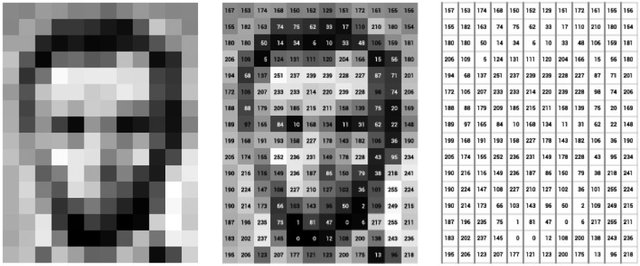
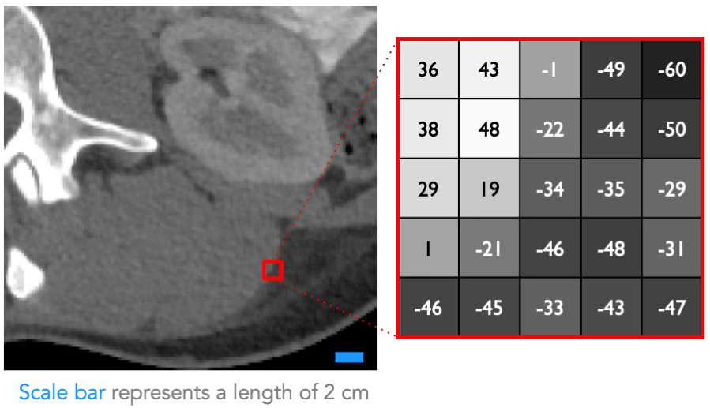

# Medical Image Formats

## Introduction

A medical image is a digital representation of the internal structure or
function of an anatomic region, typically presented as an array of picture
elements called **pixels** (2D) or **voxels** (volume pixels, 3D). This representation is a
discrete mapping of **numerical values** to positions in space.


/// caption
Image of Abraham Lincoln as a matrix of pixel values. ([Source](https://doi.org/10.1093/llc/fqy085))
///

{width=70%}
/// caption
Section of abdominal computed tomography (CT) scan with a matrix of Hounsfield units (HU). (Source: Caryn Geady)
///

The numerical values, known as **intensity values**, vary based on:

- **Image type**: MRI, CT, PET, etc.
- **Acquisition method**
- **Reconstruction and post-processing**

## Medical Image Metadata

Medical images often come with **metadata**, which provides additional
information about the image. This metadata is usually stored at the beginning of
the image file as a "header."

### Common Metadata Fields

- **Image dimensions**: Width, height, depth
- **Voxel size**: Spacing between voxels
- **Origin**: Location of the first voxel
- **Orientation**: Direction of x, y, and z axes
- **Pixel depth**: Bytes used to represent each voxel intensity
- **Data type**: Integer, floating-point, etc.

=== "DICOM"
    ``` dicom
    (0018,0015) CS BodyPartExamined = LUNG
    (0018,0050) DS SliceThickness = 3
    (0020,0037) DS ImageOrientationPatient = 1\0\0\0\1\0
    (0020,1002) IS ImagesInAcquisition = 99
    (0028,0010) US Rows = 512
    (0028,0011) US Columns = 512
    (0028,0030) DS PixelSpacing = 0.9766\0.9766
    (0028,0100) US BitsAllocated = 16
    (0028,0101) US BitsStored = 16
    (0028,0102) US HighBit = 15
    (0028,0103) US PixelRepresentation = 0
    ```

## Pixel Data

The **pixel data** in a medical image file represents the actual image values,
stored in a format specific to the image file.

- In fixed-size header formats, pixel data follows the header directly.
- In other formats, a **marker** or **tag** indicates the start of pixel data.

### **Pixel Data Size**

\[
Pixel Data Size = \text{Rows} \times \text{Columns} \times
\text{Pixel Depth (Bytes)} \times \text{Number of Frames}
\]

### **Image File Size**

\[
Image File Size = \text{Header Size} + \text{Pixel Data Size}
\]

??? tip "Example Calculation:"

    For a DICOM image with the following parameters:

    | Parameter        | Value       |
    |------------------|-------------|
    | Rows             | 512         |
    | Columns          | 512         |
    | Pixel Depth      | 2 bytes (16-bit image) |
    | Number of Frames | 32 (32 slices) |

    \[
    \text{Pixel Data Size} = 512 \times 512 \times 2 \times 32 = 16,777,216 \text{ bytes (or 16 MB)}
    \]

    Assuming the header size for this DICOM file is 1,024 bytes:

    \[
    \text{Image File Size} = 1,024 \text{ bytes} + 16,777,216 \text{ bytes} = 16,778,240 \text{ bytes (or 16.01 MB)}
    \]

## Medical Image File Formats

### Categories of Medical Image Formats

1. **Standardization Formats**: Standardize images from diagnostic modalities.
    - **Example**: DICOM

2. **Post-Processing Formats**: Facilitate and strengthen post-processing analysis.
    - **Examples**: Analyze, NIfTI, MINC

### Configurations for Storing Medical Images

- **Single File**: Contains both metadata and image data, with metadata stored
  at the beginning.
    - **Examples**: DICOM, MINC, NIfTI

- **Two Files**: Metadata and image data stored separately.
    - **Example**: Analyze (.hdr and .img)

*add diagram comparing single file vs. two-file configurations*
