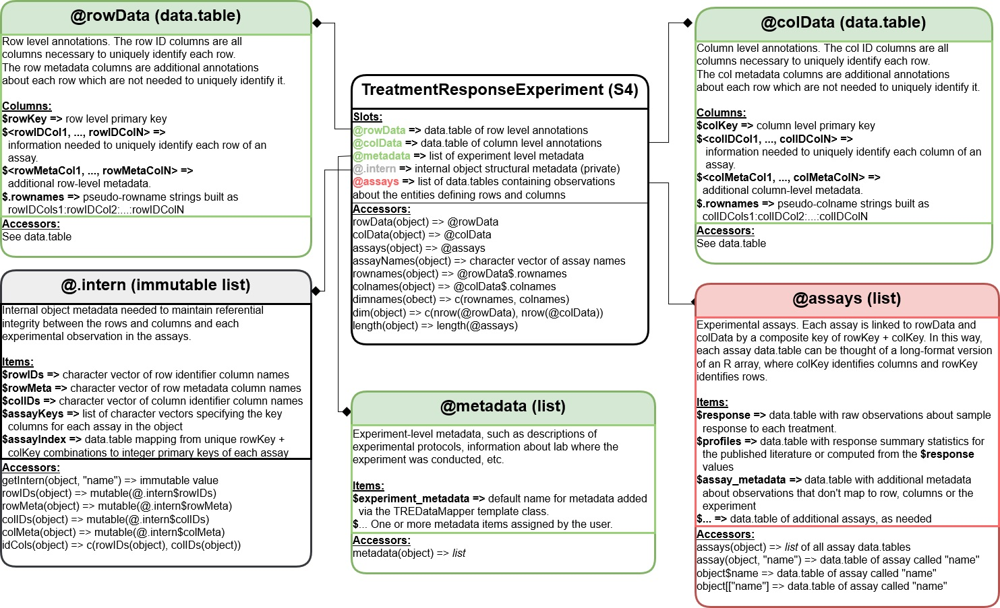

# TreatmentResponseExperiment Tutorial

## Table of Contents

- [Context](#context)
- [Summarized Features](#summarized-features)
- [Structure](#structure)
  - [Diagram of Structure](#diagram-of-structure)
  - [Key Components](#key-components)
- [Example Pipelines that create a TreatmentResponseExperiment](#example-pipelines-that-create-a-treatmentresponseexperiment)
  - [Example Repositories](#example-repositories)
- [Extra Resources](#extra-resources)

## Context

- Developed to address shortcomings of the old `@treatmentResponse` data structures
- Designed to be highly flexible, extendable, and performant for high-dimensional data
- Inspired by the design of the [SummarizedExperiment](https://bioconductor.org/packages/release/bioc/html/SummarizedExperiment.html) and [MultiAssayExperiment](https://bioconductor.org/packages/release/bioc/html/MultiAssayExperiment.html) classes

## Summarized Features



The `TreatmentResponseExperiment(TRE)` is a specialized data class from the
[CoreGx](https://bioconductor.org/packages/release/bioc/html/CoreGx.html) package,
organize and store **treatment response data** in a structured way.

- holds information about how biological samples respond to various treatments
- `treatment` usually means applying one or more drugs to a biological sample (e.g., cell lines, tissues)
- the observed **viability (survival)** of the sample after treatment and
  any **computed metrics/profiles (e.g., IC50, AUC)** are stored in the `assays` slot

## Structure

### Diagram of Structure

This structure makes it easy to work with drug response data.
It's designed to be flexible, allowing easy access and manipulation while being
performant when computing over millions of data points.


!!! note
For a more detailed explanation of the structure, see the
[TreatmentResponseExperiment Class Vignette](https://bioconductor.org/packages/release/bioc/vignettes/CoreGx/inst/doc/TreatmentResponseExperiment.html).

### Key Components

To best understand the `TreatmentResponseExperiment`, we will conceptualize it
as a data structure with four main components.

!!! tip

    You can access these respective components using the `rowData`, `colData`, `assays`, and `metadata` functions, e.g.:
    
    ```r
    rowData(tre)
    assays(tre)
    ```

1. **`rowData`** - The treatments you're testing
    - `rowIDs`: the columns that identify unique treatment experiment (make up the `rowKey`)
    - `rowKey`: the unique identifier for each treatment experiment
    - Examples of identifiers:
        - "Doxorubicin at 10 µM" (a single drug at a specific concentration)
        - "Combination of Drugs A+B at 10 µM and 5 µM respectively, for 24 hours" (a combination treatment, specifying both drugs and their concentrations, and duration)
2. **`colData`** - The cell lines or patient samples
    - `colIDs`: the columns that identify unique biological samples (make up the `colKey`)
    - `colKey`: the unique identifier for each biological sample
    - Examples of identifiers:
        - "MCF7, technical replicate B2"
        - "Primary tumor cells from patient ID-456, isolation batch 2"
3. **`assays`** - The actual results of your experiments
    - Example:
        - `assay("viability")`: a table where each cell shows how well a specific sample survived after a specific treatment
        - `Doxorubicin::10µM` for `MCF7::B2` might show a viability of `0.75` (meaning 75% of the cells survived)
        - `assay("profiles")`: a table where each unique treatment experiment has a computed metric like IC50 or AUC
        - `Doxorubicin` for `MCF7` might show an IC50 value of `0.5 µM`
4. **`metadata`** - General notes about your experiment
    - "Experiment run by Dr. Smith on January 15, 2025"
    - "All samples were treated for 24 hours at 37°C"
    - "Date of data collection: January 20, 2025"
    - "Data source: XYZ Biobank"

## Example Pipelines that create a `TreatmentResponseExperiment`

We have a handful of examples that demonstrate the various approaches, given
different data sources and formats, to create a `TreatmentResponseExperiment`.

Within each of these repositories, you will find a:

- the [`workflow/Snakefile`](https://github.com/BHKLAB-DataProcessing/gdsc-treatmentresponse-snakemake/blob/main/workflow/Snakefile) file that defines the steps to create the `TreatmentResponseExperiment`
- the [`docs/data_sources.md`](https://github.com/BHKLAB-DataProcessing/gdsc-treatmentresponse-snakemake/blob/main/docs/data_sources.md) page on the github website that describes the data sources and their formats
- the [`TreatmentResponseExperiment`](https://github.com/BHKLAB-DataProcessing/ccle-treatmentresponse-snakemake/releases/tag/v0.7.0) object created by the pipeline in Github Actions and uploaded to the `releases` section of the repository

These examples are meant to show how the `TreatmentResponseExperiment` becomes
the standardized data structure for treatment response data, regardless of the
source or format of the data.

They can then be easily used in downstream analyses, such as creating a `PharmacoSet`,
performing drug response analysis, or integrating with other data types.

### Example Repositories

- [GDSC Treatment Response](https://github.com/BHKLAB-DataProcessing/gdsc-treatmentresponse-snakemake)
- [CTRPv2 Treatment Response](https://github.com/BHKLAB-DataProcessing/ctrpv2-treatmentresponse-snakemake)
- [GCSI Treatment Response](https://github.com/BHKLAB-DataProcessing/gcsi-treatmentresponse-snakemake)
- [CCLE Treatment Response](https://github.com/BHKLAB-DataProcessing/ccle-treatmentresponse-snakemake)

## Extra Resources

- [TreatmentResponseExperiment Class Vignette](https://bioconductor.org/packages/release/bioc/vignettes/CoreGx/inst/doc/TreatmentResponseExperiment.html)
- [Bioconductor CoreGx Package](https://bioconductor.org/packages/release/bioc/html/CoreGx.html)
- [CBW Workshop 2024: Computing over a `TreatmentResponseExperiment`](https://bhklab.github.io/CBWWorkshop2024/articles/Module2.html#computing-over-a-treatmentresponseexperiment)
- [CBW Workshop 2024: Subsetting and plotting a `TreatmentResponseExperiment`](https://bhklab.github.io/CBWWorkshop2024/articles/CurveFitting.html)
