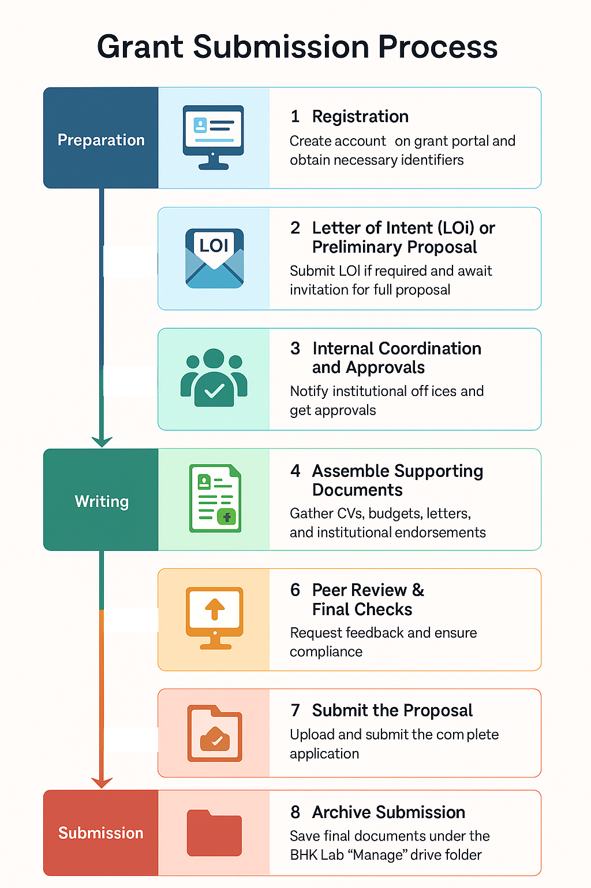

# Preparing for Submission

While there are common sections, each grant agency has specific requirements. Before submitting a grant application, ensure you have all necessary documents and have addressed key requirements.

Use this guide to navigate each stage of the grant application process, from initial registration to final submission. 
## Prerequisites

1. Create a folder under BHKLab Manage Google drive. General access is restricted to Benjamin, Soleil and Sisira, hence reach out to Sisira to create folders.

2. Sub folders **SHOULD** be arranged in the following hierarchy.

			Parent folder --> Application, Submitted, Reports
			
3. It is recommended to schedule a meeting with all PIs and lab members involved to outline the proposal.

4. Login to submission portal to check sections and create a google doc to use as a working proposal .

## Step 1: Registration

- Register on the funding agency's submission portal listed in Identifying_Suitable_Grants.md 
    - In most cases, this has to be done from the PI's account. Ask Benjamin or Sisira

- Create or update your profile with current contact information and institutional details
    - Ask Soleil for Benjamin's updated CV

- Obtain necessary identifiers of participants (e.g., CCV ID, ORCID)

!!! tip "Pro Tip"
    Attend webinars detailing the grant submission conducted by grant agencies.

## Step 2: Letter of Intent (LOI) or Registration (if required)

**Check if the grant agency requires an Expression of Interest (EOI) prior to LOI submission.**

 - Review specific grant requirements to determine if an LOI or preliminary proposal is needed

 - Draft and submit the LOI by the stated deadline
   - NPI review is required before submission

 - Wait for approval or invitation to submit a full proposal

## Step 3: Internal Coordination and Approvals

!!! tip "Pro Tip"
    Start this as early as possible to provide enough time for approvals, review etc.

 - Inform relevant institutional offices about your grant submission (e.g., UHN Research Grants, RFS)
 
 **Budgets should be added to [BusinessHub](https://uhn.my.site.com/BusinessHub/s/login/)**

 - Obtain internal approvals, budgets, and documentation

 - Coordinate with collaborators or co-investigators
 
 - If your project involves biospecimens and animal models, you will need to obtain certificates from labs that generate the data. For patient data, REB is required
 
 - Obtain Letters of Support and letters of collaboration 

## Step 4: Develop Full Proposal

 - Follow the structure outlined in the Proposal Template section
 
  - Use BHK lab [Miro](https://miro.com/) for figures (Point of contact - Sisira)
 
  - Gantt charts can be easily created with google sheets [CIHR template](https://docs.google.com/spreadsheets/d/17USwmErYzX4jQ6MpKmYDNxka5CTuk1EV9ph2BBqSkww/edit?usp=sharing)
  
  - This template can be adapted to each grants [CIHR Budget template](https://docs.google.com/spreadsheets/d/1S2BiEGzVb357udy0Jm3YaL6vq5ukUsXS5L8jSaIwZq0/edit?usp=drive_link)
  
  - Research Data management is a crucial part of all grants, access a template here [RDM](https://docs.google.com/document/d/1zCZBvnBASAqd8Ii7iBFI9pMLu31oLvpyrdXLNw2Pz2g/edit?usp=drive_link)

 - Some grant websites use specific templates for each sections, please stick to those templates

 - Draft, review, and refine each sections

## Step 5: Assemble Supporting Documents

 - Budget and budget justification

 - CVs or biosketches for key personnel

 - Letters of support or commitment
 
 - Certificates

 - Institutional endorsement or authorization

## Step 6: Peer Review & Final Checks

 - Request feedback from colleagues, mentors, or grant officers

 - Share with PIs for a final review
 
 -  Check for compliance with guidelines, formatting, and completeness

## Step 7: Submit the Proposal

 - Upload the proposal and all required documents to the submission portal

 - Run checks on the portal if available
 
 - Submit before the deadline and save confirmation docs to **Submitted** folder on drive

