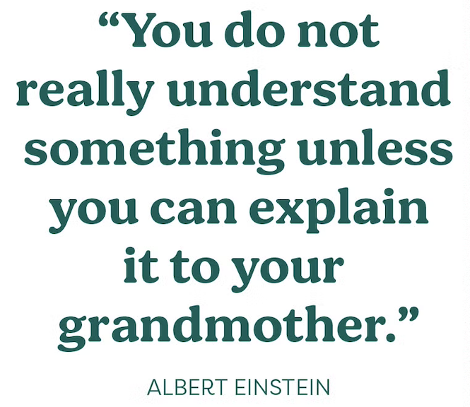

# Writing a Strong Grant Proposal

This is intended as a guide to the general sections of a full grant proposal. Please refer to the funding guidelines for specific requirements.

**Pro tip - Export your proposal to Microsoft Word to check the spelling and grammar errors, you can choose to display information about the reading level of the document. This will include readability scores according to the Flesch-Kincaid Grade Level test and Flesch Reading Ease test.** 
[Understand readability scores](https://support.microsoft.com/en-us/office/get-your-document-s-readability-and-level-statistics-85b4969e-e80a-4777-8dd3-f7fc3c8b3fd2)
## <h2 style="color: red;">Scientific part of the proposal</h2>
**Lay title and Summary/Abstract**

Write a concise, jargon-free summary that clearly explains the project's purpose, significance, and expected impact. This is often the first (and sometimes only) section reviewers read, so clarity and accessibility are key. Very relevant for non-scientific stakeholders such as patient, patient partners etc.

**Background/Problem Statement**

Present the context and significance of the research. What gap does it address? Why is it important now? Support with current literature and statistics to make a compelling case.

**Pro tip - Articulate better by dividing into sub-sections with titles instead on one big section**

**Preliminary work**

Demonstrate that the project builds on solid groundwork. Include a table of data, previous publications, or plots from proof-of-concept studies to show feasibility and credibility. These should be indexed in the text as well. 

**Pro tip - Include an Overiew of the research idea, highlight preliminary sections vs. Aims**

**Hypothesis**

State the central hypothesis or research question. It should be specific, testable, and grounded in the background presented. A well-defined hypothesis guides the aims and methodology.

**Specific Aims**

Clearly defined research objectives or aims. Brief summary of the hypothesis or core research question. What the project seeks to accomplish and why it's significant.

**Methodology**

Detailed description of the research design, methods, and techniques to be used. Justification for chosen approaches. 

**Feasibility, Risk & Mitigation Strategies**

Outline potential risks or challenges (technical, ethical, logistical) and explain how they will be mitigated. Highlight available expertise, access to necessary infrastructure, and alternative approaches.
For example, mention statistical model limitations, data privacy, clinical data acquisition challenges etc.

**Project Outcomes and future directions**

Describe the expected scientific outcomes and broader impact. Indicate how the findings will be disseminated and how they may inform future research or policy. Include any plans for scaling, follow-up studies, or knowledge translation. Include Gantt chart for Timeline and milestones.

**Pro tip - For Gantt chart, you can enhance visualization by coding dark colors to initial deliverables and light colours for improvements or updates following early studies.**

**Research Data Management & Open Science**

Detail how data will be collected, stored, shared, and preserved. Include plans for open access publication, data repositories, and compliance with FAIR data principles (Findable, Accessible, Interoperable, Reusable).

Note: If your proposal includes private data access, include secure storage plans via H4H or GCP. Mention the size of data if known. Adhere to the regulations included in the Personal Information Protection and Electronic Documents Act (PIPEDA), Health Insurance Portability and Accountability Act (HIPAA) and the General Data Protection Regulation (GDPR) for Canada, USA, and Europe, respectively. Also refer to First Nations principles of Ownership, Control, Access, and Possession (OCAP) in Canada and mention if applicable.

**Expertise, Experience & Resources**

Most grants include multiple labs. Highlight the strengths of each teams. Include relevant expertise, past accomplishments, and institutional support (labs, equipment, collaborations) that ensure project success.

## <h2 style="color: blue;">Other sections</h2>

**Sex and/or Gender considerations (SGBA)**

Discuss how sex and/or gender will be considered in the design, data collection, analysis, and interpretation of results. If SGBA is not applicable, provide a rationale for its exclusion

**Summary of Progress**

Often refers to NPI's research progress so far. Please reach out to your NPI as they might have a draft already.

**Budget**

Please check grant agency specific requriements for budget. Breakdown the costs, cross the t's dot the i's

 - Personnel: Salaries, benefits, and stipends for staff and researchers

 - Consumables: Supplies and materials needed for experiments. 

 - Non-Consumables: Equipment purchases or rentals

 - Knowledge Translation: Costs for dissemination activities, open access publishing, stakeholder engagement

**Peer review information**

To be discussed with NPI. The lab has a list of PI names and credentials required for this section.

**Suggested Peer Review Committees**: List preferred committees or panels for reviewing your application

**Reviewers to Exclude for this Application**: List any individuals or groups that should not be involved in the review process, with justifications if required