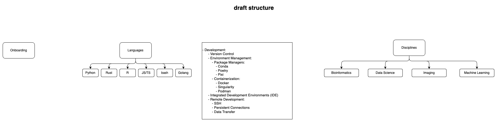

# Home

## Welcome to the BHK Lab Handbook!

The handbook is a collection of resources for the BHK Lab. It is intended to be a resource for all BHK Lab members to learn about the lab, its projects, and how to get involved.

Draft structure:

Insipiration:

  - [Koesterlab Handbook](https://koesterlab.github.io/data-science-for-bioinfo/)
  - [Candice Morey Lab Handbook](https://ccmorey.github.io/labHandbook/)
  - [Baby Lab Handbook](https://mcmaster-baby-lab.github.io/handbook/)
  - [Lowe Power Lab Handbook](https://github.com/lowepowerlab/lab_handbook)
  - [Vortex Lab Handbook](https://github.com/uw-vortex/VORTEX-handbook)
