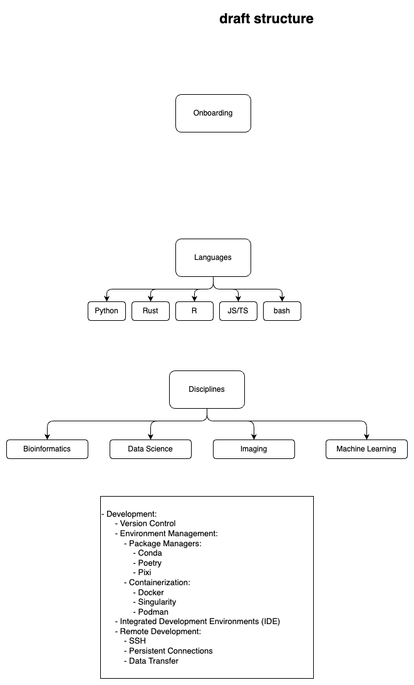

# Handbook

## Welcome to the BHK Lab Handbook!

Draft structure:

Insipiration: 

  - [Koesterlab Handbook](https://koesterlab.github.io/data-science-for-bioinfo/)
  - [Candice Morey Lab Handbook](https://ccmorey.github.io/labHandbook/)
  - [Baby Lab Handbook](https://mcmaster-baby-lab.github.io/handbook/)
  - [Lowe Power Lab Handbook](https://github.com/lowepowerlab/lab_handbook) 
  - [Vortex Lab Handbook](https://github.com/uw-vortex/VORTEX-handbook)
  
## This handbook is built using MkDocs

For full documentation visit [mkdocs.org](https://www.mkdocs.org).

### Commands

* `mkdocs new [dir-name]` - Create a new project.
* `mkdocs serve` - Start the live-reloading docs server.
* `mkdocs build` - Build the documentation site.
* `mkdocs -h` - Print help message and exit.

### Project layout

    mkdocs.yml    # The configuration file.
    docs/
        index.md  # The documentation homepage.
        ...       # Other markdown pages, images and other files.
