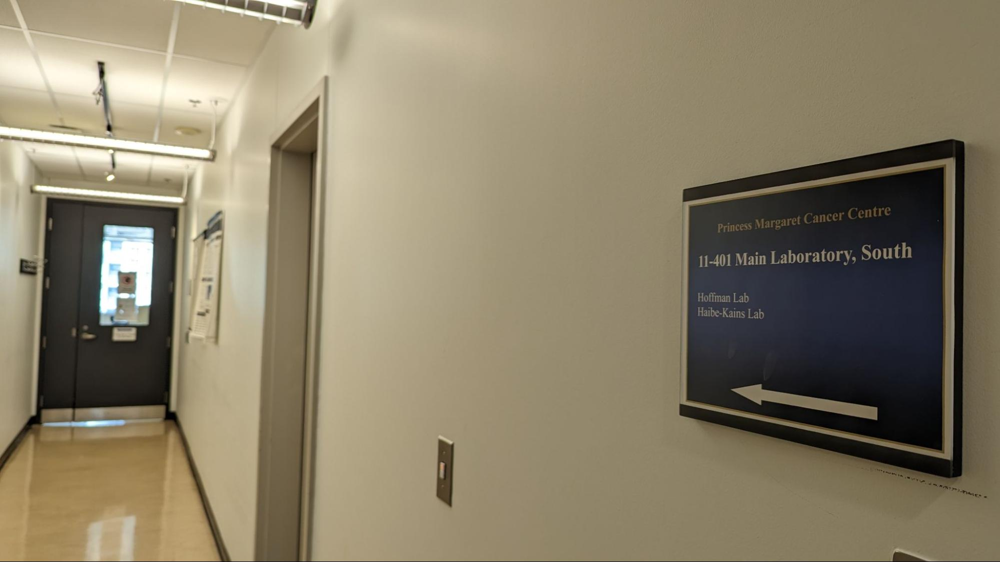

# [BHKLab Onboarding Policy](#bhklab_onboarding_policy)

## PMCRT Lab Tour
### Lab Location
The BHKLab is located in room 11-401 of the Princess Margaret Cancer Research Tower (PMCRT) in the MARS Discovery District.

#### Directions to the lab
1. Find the elevators nearest to [Mercatto](https://www.google.com/maps/place/Mercatto/data=!4m2!3m1!19sChIJiXa3MrY0K4gRXBkKpUGIqvs) on the MARS ground floor . If you are exiting the PMCRT security office, walk up the hallway ramp, through the frosted glass doors, and go straight across to the elevators.

2. Go to the 11th floor of PMCRT. If the button does not work, tap your security card on the black glass below the floor buttons on the left side of the elevator.

3. On the 11th floor, when you cross the security doors, make a right and go down the hallway. Turn left when you reach the next hallway with a sign that reads "11-401 Main Laboratory, South". 

    {width=90%}

4. Go through security doors and make a left.

### Lab Coordinator Onboarding
On the first day in the lab, all new employees will be scheduled for a research onboarding by the Lab Coordinator. During the research onboarding, you will be provided an office tour of the physical and/or digital workplace. The digital office tour will include an overview of our internal research systems including: 

- [Confluence Statement of Work (SOW)](../../General/Summary_Of_Work/index.md)
- Google calendar, and the dates of [lab meetings](../../General/Meetings/lab_meeting.md) and [journal club](../../General/Meetings/journal_club.md)
- BHK Lab Slack
- [BHK Lab GitHub](https://github.com/bhklab) (added by supervisor/mentor as this is project specific)
- Any additional programs/systems specific to the employee’s work duties

In the physical labspace, confirm that the following items are set up:

- [x] Employee has picked up their UHN Photo ID card from Toronto General Photo ID office (Department is “Princess Margaret - Research”)
- [x] Employee has picked up their PMCRT Access card from the PMCRT security office
- [x] Assigned to a [workspace in the lab](https://docs.google.com/spreadsheets/d/1LOKDkhRi4wDBf5Cg5Cjzzdeh0frhG4YZ5h11d835Qa0/edit?gid=0#gid=0)
- [x] Ensure the employee has access to a computer/monitor, keyboard, and mouse if available in the [Lab Equipment Inventory](https://docs.google.com/spreadsheets/d/1zFbTAdv5DT6tnajDMeXwoWP65VzjcD9PxynnXzholwE/edit?gid=212760015#gid=212760015&fvid=1274444863)

## [BHKLab Onboarding Form](https://docs.google.com/forms/d/e/1FAIpQLSem1WRpvKiHyeMop-sOsRx7NOd0hWbT2PGRRxiz3nfR3GUPEQ/viewform?usp=sf_link)
The employees will then be directed to their supervisor/mentor. Together, you can begin to fill out the [BHKLab Onboarding Form](https://docs.google.com/forms/d/e/1FAIpQLSem1WRpvKiHyeMop-sOsRx7NOd0hWbT2PGRRxiz3nfR3GUPEQ/viewform?usp=sf_link). This form will help guide you through the onboarding process. When complete, you should have set up or initiated the following items:

- [x] Creation of a [BHKLab Google account](https://support.google.com/mail/answer/56256?hl=en) (long-term employees only)
- [x] Invitation to BHKLab Google Calendar with view-only permissions
- [x] Invitation to [BHKLab Slack](http://bhklab.slack.com)
- [x] Invitation to [BHKLab GitHub Team](https://github.com/orgs/bhklab/teams/bhkteam)
- [x] Set up for [HPC4Health access](https://bhklab.github.io/HPC4Health/setup/getting_an_account/) (if applicable)
- [x] Add to Atlassian Crowd Group for [Confluence SOW](https://collaborate.uhnresearch.ca/confluence/pages/viewpage.action?spaceKey=BHKLabSOW&title=BHKLab-SOW)
- [x] Add prefered email address to the ["BHKLab" Google Group](https://groups.google.com/g/bhklabresearch/members) - this will be used for lab-wide communication 
- [x] Add BHKLab Gmail to the ["BHKLab Google Accounts" Google Group](https://groups.google.com/g/bhklab-accounts/members) - this will be used to grant access to BHKLab Google Drive documents
- [x] Any other resources deemed necessary
