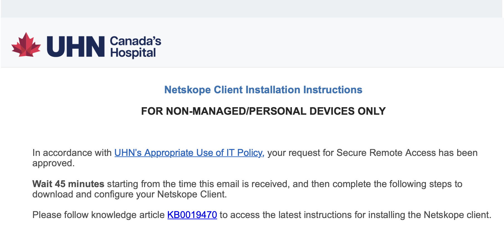

# Configuring UHN VPN

## Quick introduction: why do we need a VPN?

A Virtual Private Network (VPN) is essential in the workplace to ensure secure and private access to the company network, especially when working remotely or on public Wi-Fi.

A VPN encrypts internet traffic, protecting sensitive data from potential cyber threats and unauthorized access. This helps maintain confidentiality, ensures data integrity, and supports secure access to internal resources, safeguarding the organization's digital environment.

The [Netskope Zero Trust Network Access](https://docs.netskope.com/en/netskope-client) (ZTNA) client is UHN's VPN service for non-managed/personal devices. Netskope provides secure, encrypted access to the corporate network, ensuring users can safely connect to company resources from any location, while maintaining data security and compliance with organizational policies.

## Setting up Netskope VPN on personal devices

During your onboarding, the lab's Research Administrative Coordinator, Soleil, will put in a request to UHN IT for your VPN access. IT will generally accept the request quickly, and send instructions to your corporate email on the steps to follow to install and configure the VPN:



Follow the link to the knowledge article or the instructions in the email to complete your setup.  
If you have any issues or questions, contact the UHN Helpdesk at help@uhn.ca.

!!!tip "Connecting to the VPN onsite"
    If you are trying to set up the VPN for the first time _while onsite at the BHKLab_, you will need to make sure your device is connected to _UHN-Guest-Wifi_.  
    The VPN will not work if your device is connected to the _UHN-wireless-corporate_ wifi.

---

## Setting up GlobalProtect VPN (old software)

!!!warning  
    __GlobalProtect is being phased out by UHN. Individuals currently using GlobalProtect on unmanaged devices will gradually migrate to Netskope Zero Trust Network Access (ZTNA) starting in March 2026. Impacted users will receive email notifications with details about migration timing and next steps.__

During your onboarding, the lab's Research Administrative Coordinator, Soleil, will put in a request to UHN IT for your VPN access. IT will generally accept the request quickly, and send instructions to your corporate email on the steps to follow to install and configure the VPN.

If you are a Windows or Mac user, that's it. The manual is pretty good, simple and straightforward. Follow the steps and you've got this. Easy.
If you are on Ubuntu... There's no downloading link or steps. You get stuck on the very first step. Don't worry, you don't have to open a ticket on Helpdesk and wait for them to respond... The next section will make things easier for you.

### Downloading GlobalProtect software on Ubuntu

After contacting Helpdesk a few times, I finally got an email with the downloading instructions for Ubuntu. Here I leave the email, I think it may be useful.

Download the installation file from the [link](https://roseshare.rose-hulman.edu/portal/s/162637781701644125980.tgz) or via the curl command:

```console
curl https://roseshare.rose-hulman.edu/portal/s/162637781701644125980.tgz --output PanGPLinux-5.3.0-c32.tgz --ciphers 'DEFAULT:!DH'
```

Unzip tar file, by running:

```console
tar -xvf PanGPLinux-5.3.0-c32.tgz
```

Install the program:

On Ubuntu/Debian, this is done through the command:

```console
sudo dpkg –i GlobalProtect_deb-5.3.0.0-32.deb
```

On Redhat/CentOS, this is done through the command:

```console
sudo yum localinstall GlobalProtect_rpm-5.3.0.0-32.rpm
```

To start the program, simply enter in a shell:

```console
globalprotect
```

and then a prompt should display.

From the prompt, run:

```console
connect -portal connect2.uhn.ca
```

Login with your email address (<username@uhn.ca>) as your username and password.

Type quit to exit the prompt.

That's it - just remember connecting and disconnecting the VPN every time you need it.

### Connecting to VPN on Ubuntu

Now that you have your laptop configured for the VPN, don't forget connecting every time you want to use it, running the following command:

```console
globalprotect
```

And then running in the prompt:

```console
connect -portal connect2.uhn.ca
```

When you want to disconnect from the VPN, you have to run

```console
globalprotect
```

And then in the prompt:

```console
disconnect
```
