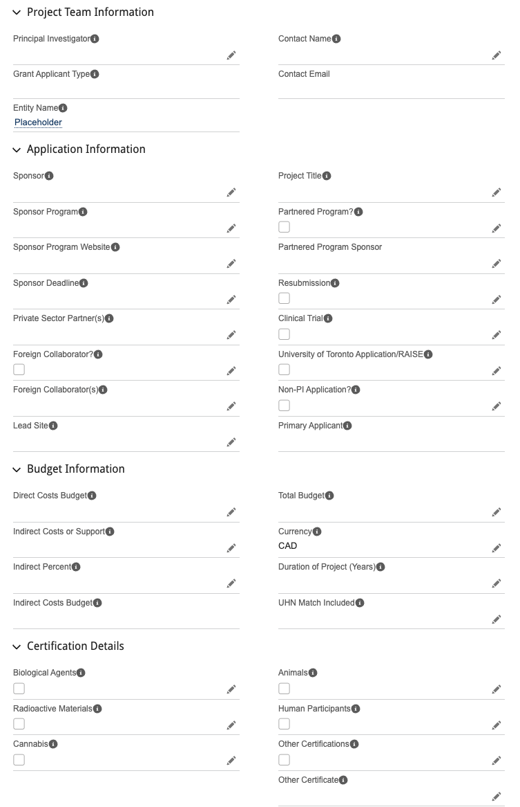

[UHN Grant Application Module Info](https://universityhealthnetwork.sharepoint.com/teams/ResGrantsAwards/SitePages/GrantApplicationModule.aspx)

Budgets must be submitted to UHN through their [Business Hub application portal](https://universityhealthnetwork.sharepoint.com/teams/ResGrantsAwards/SitePages/GrantApplicationModule.aspx#:~:text=Access%20the%20Grant%20Application%20module%20through%20the%20Business%20Hub). In case you don’t already have access to Business Hub, please see the [Delegation](https://universityhealthnetwork.sharepoint.com/teams/ResGrantsAwards/SitePages/GrantApplicationModule.aspx#delegation:~:text=on%20my%20behalf%3F-,Delegation,-Delegates%20who%20have) section on the SharePoint module, which includes a form to be filled out so <Business.Hub@uhn.ca> can provide you with access.

Once you have access to Business Hub, navigate to the Grant Applications page and click New Grant Application.

1. Select Full Application
1. Fill out the form with your budget information.
    
1. Once you've submitted, you'll receive an email with feedback from the grants office and whether you're approved for submission.

---

Budgets need to be sent to <grants@uhn.ca> for approval.
In email, include:

- Budget outline
- Project proposal
- What grant is being applied for
- Principal applicant name
- Deadline for submission
- If the grant is multi-institutional 