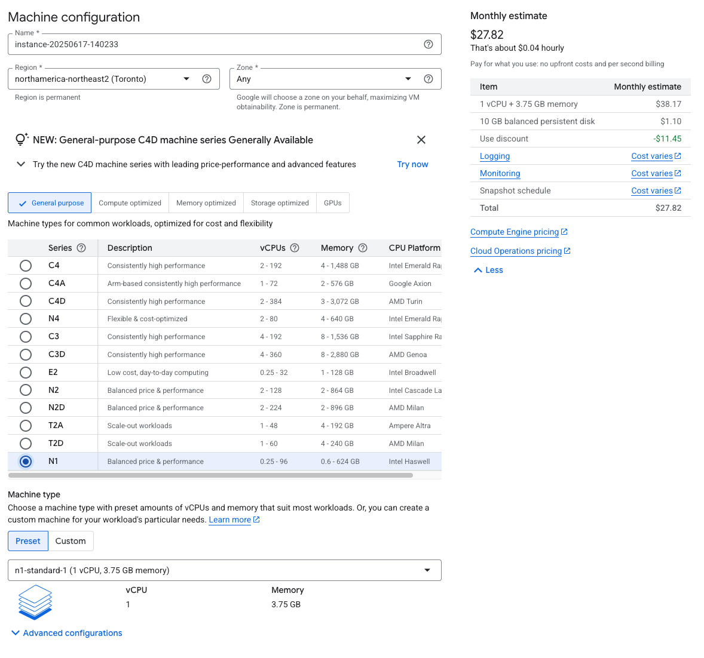
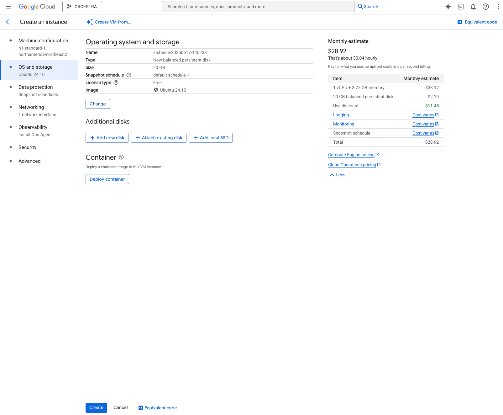
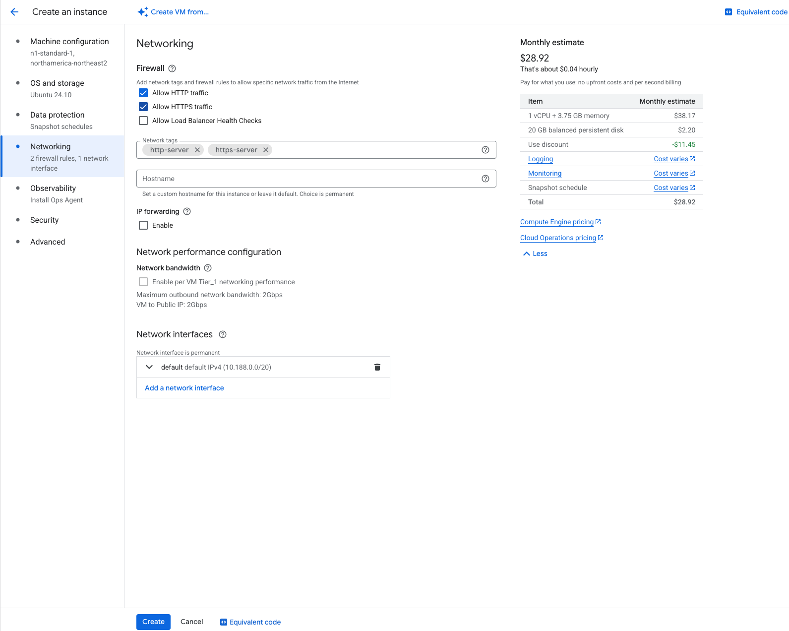
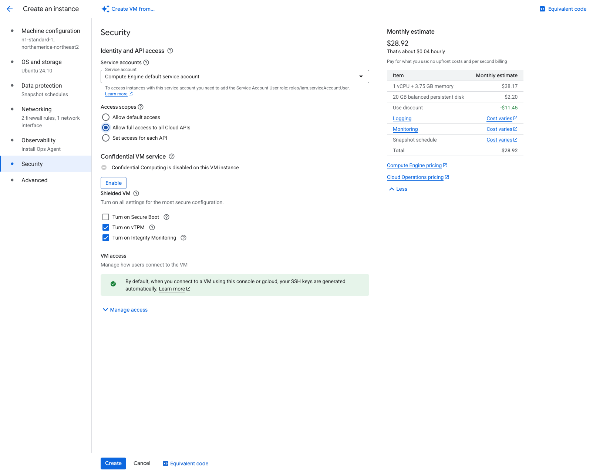

# Compute Engine

Compute Engine on GCP is the standard and most basic VM creation workflow (similar to EC2 on AWS or Virtual Machines on Azure). It is the most common way in the lab to deploy web applications and API's.

## Why Compute Engine

Despite how basic Compute Engine is, it is extremely important for the following reasons:

- Allows for full control.
	- Nginx configurations (allowing for many different projects to be routed to)
	- Certificate management for domains or sub domains
	- System services management (Ideal for many APIs)
- Available 24/7, no downtime or boot up time unless explicilty enforced
	- Unlike Cloud Run or Build where when the application becomes dormant, there will be boot up time upon requesting access to the resource (not ideal for API's or web-apps)
- Fairly cost effective. 
	- $25-35 CAD/month for a front-end and back-end deployment that will accessible 24/7
- Relatively easy to use if you're familiar with Linux/Unix systems


## Cost

Compute Engine VMs can really vary in cost. You usually need a basic n1-standard-1 for a web application deployment (front-end+API). This tends to cost $25-35 CAD/month depending on how much SSD is needed on the VM to clone the project and host data if needed. However, with some very light workflows or beta/QA deployments you can get away with using a f1 micro or g1 small which will only cost around 10-15 CAD/month.

## Compute Engine VM Settings For Web Applications

1. Navigate to 'Compute Engine' --> 'VM instances'.
2. Press 'Create instance' in the top left.
3. Select your machine type and region (restricted to Montreal/Toronto).

4. Then select your OS and base storage size
	- It is reccommend to use Ubuntu's 24.10 or newer image. Note: Avoid image's tagged as 'minimal' since they don't include many of the base packages that are extremely useful for getting started on a VM.
	- 15-20GB is also a good base disk size for typical front-end/back-end combos. This may need to be altered depending on your respository sizes but typically this is a good range.

5. Under the data protection tab you can turn snapshots off unless this is a high profile project where data must remain persistent and safe under critical failure instances.
6. Under the networking, make sure to turn on HTTP and HTTPS traffic so that the VM is accessible.

7. Under the security tab "allow full access to all cloud APIs" if they are to be used for the project to avoid difficulties later on.



## Compute Engine Configurations for Web Apps

Typically there are a few things that are standard for all VM configurations for web applications in the lab.

1. Create a master user
	- This important so that anyone who wants to adjust configurations or processes on the VM can do so
```
sudo adduser admin_uhn
sudo usermod -aG sudo admin_uhn
```
2. Install the needed version of nodejs/npm via NVM (Node Version Manager) for the project to be cloned
	- Install NVM:
	```
	curl -o- https://raw.githubusercontent.com/nvm-sh/nvm/v0.39.7/install.sh | bash
	```
	- Make NVM accessible to the logged in user on the VM:
	```
	export NVM_DIR="$([ -z "${XDG_CONFIG_HOME-}" ] && printf %s "${HOME}/.nvm" || printf %s "${XDG_CONFIG_HOME}/nvm")"
	[ -s "$NVM_DIR/nvm.sh" ] && \. "$NVM_DIR/nvm.sh" # This loads nvm
	```
3. Set up Nginx
	- install Nginx:
	```
	sudo apt install nginx
	```
	- Give account write access to Nginx's www folder:
	```
	sudo chown -R admin_uhn:admin_uhn /var/www/
	```
	- clone project in /var/www
	- Remove default Nginx file existing at /etc/nginx/sites-available/ and /etc/nginx/sites-enabled/
	- Setup Nginx project configurations in /etc/nginx/sites-available:
	```
	server {
		client_max_body_size 20M;
		listen 80;
		server_name _; # Can be replaced with a domain name if you have one for your project
		root /var/www/repo-name/client/build; #Where your built index.html file resides
		index index.html;
		
		location / {
			try_files $uri $uri/ /index.html;
			add_header Cache-Control "no-cache";
		}

		location /api {
			include proxy_params;
			proxy_pass http://localhost:2000;
		}
	}
	```
	- Add symlink file to sites-enabled so that files stay synced when changed:
	```
	ln -s /etc/nginx/sites-available/file-name.nginx /etc/nginx/sites-enabled/file-name.nginx
	```

