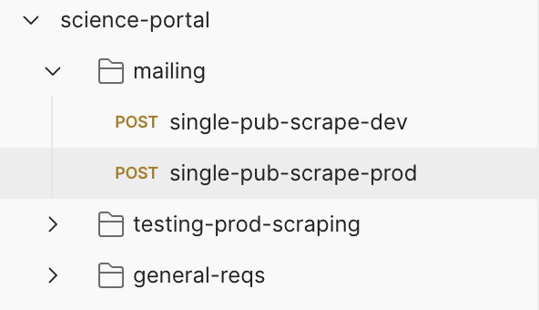

# Postman

Postman is a free downloadable tool primarily used for testing API's or web sockets. Within Postman you can save collections of API routes and/or socket connections dedicated to a project and specific project functionality.

{: style="height:100%;width:100%"}

Where Postman is most useful:

1. Constructing an API from the ground up. This is because you can quickly swap arugments, adjust headers, and retrigger the route frequently.
2. Testing queries of an external API. This is because errors are formatted which makes it easier to digest (errors are common when querying a new API), 
3. Having the ability to share your created collections with new project members, new developers, or even external collaborators.
4. Being able to easily pick up where you left off years/months after working with an API.

